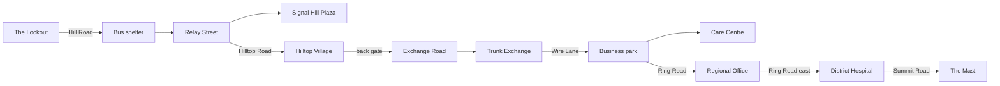
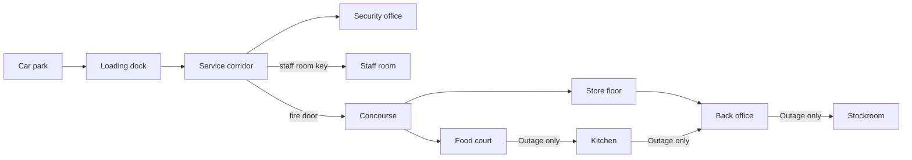
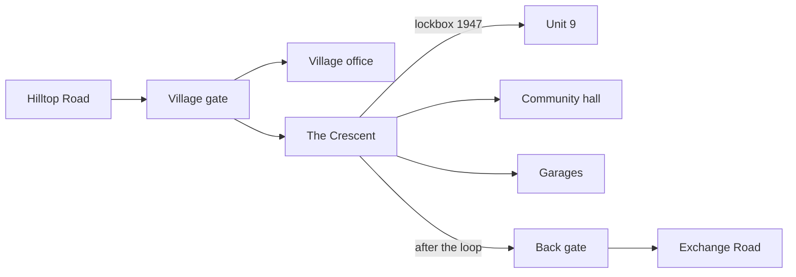
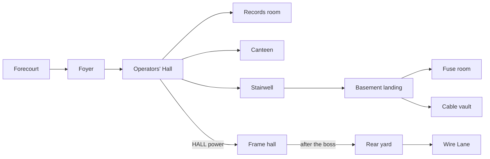
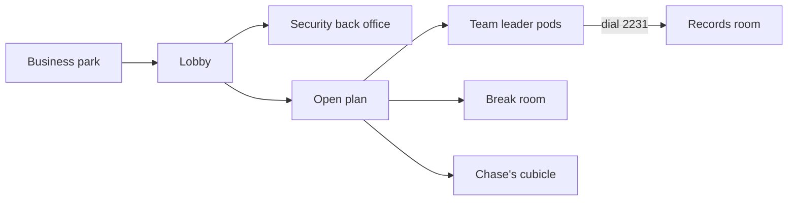
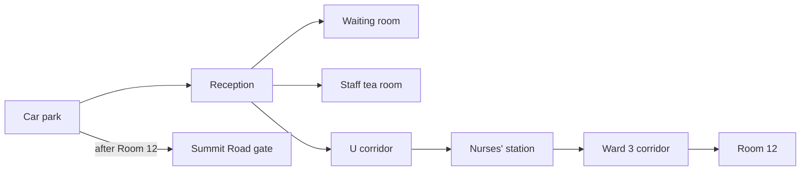

# Signal Hill — Build Prompt

Sep 24, 2026 · @Luka

## 1. Brief and hard constraints

You are building **Signal Hill**: a story-driven psychological horror game in one self-contained HTML file, played through fixed cinematic camera angles, with cutscenes at its heart. Story and characters come first. Every system, room and monster exists to serve them.

**How this prompt is organised.** Sections 1 to 7 define the engine and rules; section 2A sets the classic survival-horror UI and presentation. Sections 7A and 7B lay out the town and every building. Sections 8 to 12 are the complete script, moment by moment. Section 13 holds every document's text. Section 14 sets the build order and the checks that prove it works.

### The story in one paragraph

Aidan, 22, is six months into a job as a sales rep at an Optus store in the city. A returned modem arrives from a customer in Signal Hill, a fog-bound hill town with no mobile coverage, with a note: "You said it would work here." He drives out to fix it, believing he made an honest mistake when he sold an elderly woman the wrong things. The truth the game makes him remember is worse. Her grandson Luke rang the store three times because her medical alarm had stopped working. The callback was assigned to Aidan, and he set it to "Follow up tomorrow" three days running because he was scared. She fell, the alarm couldn't connect, and she's now in hospital with a broken hip. Signal Hill turns the real fears of frontline staff into monsters. Aidan meets four colleagues and Luke, each trapped in their own fear, and the game ends when he finally makes the call.

**Theme:** fear isn't the monster; hiding from it is. There are no villains. The horror is played completely straight, with no jokes during the horror.

### Hard technical constraints

- One .html file. All code, CSS, data and generated assets are inline.
- Three.js (r160 or later) is loaded as an ES module through an import map from cdn.jsdelivr.net. Its official addons (EffectComposer, RenderPass, ShaderPass) come from the same CDN. Make no other network requests.
- No image, model, audio or font files. Build all geometry from primitives in code. Generate all textures with Canvas 2D at load time. Synthesise all sound with the Web Audio API. Use system fonts.
- Target 60 fps on a mid-range laptop and never drop below 30 fps. Render at a reduced internal resolution (section 2).
- Keyboard and mouse come first, with full Gamepad API support. Build for desktop only.
- Save to localStorage: three manual slots (at payphones) plus an autosave at the start of each chapter. A save stores everything, including the Face/Avoid counters and fate flags.
- Keep content in data, separate from engine code: `ROOMS`, `CAMERAS`, `CUTSCENES`, `DIALOGUE`, `DOCUMENTS`, `CALLS`, `ITEMS`, `SPAWNS`. It must be possible to add a chapter without touching the engine.
- A first playthrough takes 60 to 120 minutes (time budget in section 14).

### Content rules

- Horror comes from dread, sound, framing and body horror built from retail materials. No gore.
- No self-harm, suicide or hanging imagery anywhere, including cords around necks. Characters who are "lost" walk into the fog. Nobody dies on screen.
- No characters, creatures, music or assets from any existing horror game. Every monster in this prompt is original.
- Optus branding: use the name on store signage and in dialogue, with a teal-and-yellow palette and a simple original wordmark drawn in code. Don't recreate the real logo.
- Every human character is sympathetic. Customers are frightened people, not villains.
- Characters use first names only. The customer at the centre of the story is called "Nan" by Luke and is never named on screen.
- Chase's attack and Nan's fall are treated with care: shown through aftermath and dialogue, never staged for shock.

## 2. Look and sound

The game should look like an early-2000s survival horror game seen through a dirty lens. Think low resolution, heavy fog, film grain, deep shadow and a single torch beam.

### Rendering pipeline

- Render to an internal target at 55% of window resolution and upscale with linear filtering. Cap the pixel ratio at 1.
- Post-processing chain: animated film grain (strength 0.08 in the Fog world, 0.14 in the Outage), a vignette, slight chromatic aberration at the edges, and a colour grade per world. In the Outage, add rolling scanline flicker and a faint horizontal sync-slip every 8 to 15 seconds.
- Fog: FogExp2 with outdoor density 0.075 (about 15 m visibility) and indoor 0.03. Fog colour is #8e9996, a grey-teal. Layer noise-textured billboard fog sheets that drift slowly, so fog visibly moves in front of lights.
- "Dead air" particles: sparse white specks drifting slowly upward in every Fog-world exterior, like static made visible.
- Lighting: very low ambient. Aidan's phone torch is a SpotLight at chest height with a 28° cone, soft penumbra and soft shadows (1024 map). It flickers when a monster is within 6 m. Streetlights are sparse orange point lights with halo sprites. Emissive screens and LEDs add colour.
- Materials: MeshStandardMaterial with generated canvas textures for grime, water stains, cracked render, carpet tile, lino, faded posters, signage and paper.

### The two worlds

|  | Fog world | Outage |
| --- | --- | --- |
| Palette | Desaturated grey, teal tint, sodium-orange accents | Near-black, sick teal (#1f6f6a), warning yellow (#e8c21a), LED red |
| Surfaces | Shuttered shopfronts, faded plan posters, wet bitumen, lino, carpet tile | Walls of stacked contracts, wet cardboard, carpet tiles curled back over green circuit board, receipt paper hanging from ceilings, coiled security tethers hanging like vines |
| Light | Torch, sodium lamps, fog glow | Torch, screen glow, blinking red LEDs, flickering fluorescent tubes |
| Sound | Wind, static, a distant shop-door chime | Receipt printers, half-speed hold music, EFTPOS beeps, phones ringing one room away |

**The Outage transition.** Reuse this sequence every time, and keep the player in control throughout:

1. A dial-up handshake rises from everywhere and climbs into a siren over 6 seconds.
2. Grain and aberration ramp up.
3. Lights die bank by bank toward the camera.
4. Surfaces swap to their Outage textures through a noise-dissolve shader.
5. The siren cuts dead and the phone bars start to climb.

Leaving the Outage reverses the swap with no siren, just a long exhale of static.

### Characters on screen

- Build humans from primitives with care: correct proportions, layered clothing (polo, hoodie, lanyard), and faces painted on canvas textures with eyes that blink and look.
- Use a procedural rig (an Object3D bone hierarchy) with hand-written procedural animation: walk, run, idle breathing, head look-at, and each character's gestures (section 5).
- Body language carries the drama. In cutscenes, characters hold long stillness, look past each other and fidget.

### UI

Every menu, screen and on-screen element follows section 2A.

### Sound (all Web Audio synthesis)

- Ambient beds per area: layered filtered noise for wind, detuned low drones, distant metallic creaks, and a two-tone shop-door chime every 40 to 90 seconds from nowhere in particular.
- Footsteps per surface: tile, carpet, lino, bitumen, gravel, metal grating, ladder rungs.
- Signature sounds, each a reusable function: shop-door chime, EFTPOS approved beep, receipt printer, dial-up handshake into siren, hold music (an original cheerful 8-bar melody on a soft square wave with tape wobble), manager keys chiming, pen click, phone vibration, message chime, phone ring (an old double-burst ring), line static, disconnected tone.
- Phone static: band-passed noise whose volume follows the nearest threat. Each monster adds its own tell (section 6).
- Music is rare and emotional. It uses three motifs on a synthesised felt piano (sine plus decaying harmonics, soft attack):
  - **Tomorrow** (Aidan): four descending notes that never resolve. It plays under any scene involving the callback.
  - **Nan**: a slow, warm phrase in a major key with one sad note. It plays in the prologue voicemail and the Connected ending only.
  - **The Line** (Wai): two notes a fifth apart, repeating like a dial tone.
- The Outage has no music, only a slow industrial pulse built from receipt-printer steps.
- There's no voice acting. All dialogue is subtitled text (section 7).

## 2A. Classic survival-horror UI and presentation

Every screen outside of play must look, sound and behave like a classic early-2000s Silent Hill game: black, quiet, serif and slightly old. Match those conventions closely, but build every asset, logo and screen layout fresh. Nothing is copied from the real games.

### Principles

- Black backgrounds, generous empty space, thin serif type, off-white and grey text. No rounded corners, panels, gradients or modern icons. The only images are 3D item models and the phone's signal bars.
- No modern HUD: no health bar, minimap, quest marker, objective tracker, damage numbers or floating button icons in the world.
- Everything fades. Menus and screens fade through black over 0.3 to 0.5 s. Nothing slides, bounces or scales in.
- Film grain stays on over every menu at 60% of its in-game strength, so the whole game feels like one piece of old film.
- UI sounds (synthesised): a soft low tick to move, a muted click to confirm, a dull thud to cancel, a paper rustle for the map and memos, a slow whoosh when rotating items.

| Use | Font | Style | Colour |
| --- | --- | --- | --- |
| Title and area cards | Georgia, Times New Roman | Capitals, letter-spacing 0.3em | #d9d6cc |
| Menu items | Georgia | Capitals, 18 to 20 px | Unselected #6f6f6a; selected #e8e4d8 with a thin underline |
| Messages and subtitles | Georgia | Sentence case, soft black shadow, no box | #f0ede4 |
| Examine thoughts | Georgia | Italic | #f0ede4 |
| Official documents | Courier New | Typewriter or dot-matrix look | Near-black on paper |
| Handwriting | Cursive system stack | Slightly uneven baseline | Blue or black ink |

### Title screen

1. Three seconds of black and static hiss.
2. Fade up on a slow static shot of the fogged town from the Lookout. The mast's red light blinks far off. Dead-air specks drift upward.
3. "SIGNAL HILL" fades in, centred, in widely spaced serif capitals. Two seconds later, smaller beneath it: "PRESS ANY KEY".
4. On a keypress, a distant phone that's been ringing the whole time stops mid-ring. The menu fades in, bottom centre: NEW GAME, LOAD GAME, OPTIONS, EXTRA (EXTRA appears after the first ending and lists endings seen, past results and New Game+).
5. After 60 idle seconds, play an attract sequence: slow, silent shots of empty locations (Relay Street, the Crescent, the Operators' Hall, the atrium) with no text, then back to the title.

### New game setup

On black, two choices, each with a one-line description beneath:

- **ACTION LEVEL:** EASY, NORMAL, HARD.
  - Easy: enemies deal 50% damage and healing pickups are 1.5 times as common.
  - Normal: as written in this prompt.
  - Hard: enemies deal 150% damage, a Reach's rage builds 1.5 times faster, and there are 30% fewer pickups.
- **RIDDLE LEVEL:** EASY, NORMAL, HARD. This changes how the puzzle clues are written:

| Puzzle | Easy | Normal (as scripted) | Hard |
| --- | --- | --- | --- |
| Ch 1 terminal PIN | The sticky note says "PIN = your induction date, DDMM" | "The day you became one of us" + the certificate | The note says "The day you became one of us. Day first." and the certificate spells the date out: "the fourteenth of March" |
| Ch 2 lockbox | Luke's note gives the code: 1947 | Birth year + the "Happy 79th" card | The card says only "our Unit 9 champion, born the year the Route 44 depot opened"; the timetable footer reads "Route 44 depot est. 1947" |
| Ch 3 fuses | HALL and FRAME are ticked in chalk | Amp loads on the board | Loads given only in watts on a spec sheet (HALL 960 W, FRAME 1,440 W, RECORDS 480 W, BASEMENT 720 W, CANTEEN 240 W, MAST FEED 1,920 W) with the note "Old girl takes 2,400 watts" |
| Ch 4 pulse dial | Aidan's notes log the digits after one listen | After two listens | Never logged, and the clicks are faster |
| Ch 8 gate | Wai (or the card) states "1961" | "The year the exchange opened" | "The day and month the exchange opened"; the code is 1408 |

After the choices, a first-time player gets the brightness calibration screen: a single signal bar on black, and "Adjust until the bar is barely visible."

### Pause menu

- Esc freezes the game and dims it to 40%. A vertical serif list fades in at centre left: RESUME, ITEMS, MAP, MEMOS, PHONE, OPTIONS, QUIT TO TITLE.
- The current area name sits small at top right, e.g. "HILLTOP VILLAGE" or "HILLTOP VILLAGE — ???" during the Outage.

### Items screen

- A black void. Items sit in a horizontal row across the lower middle of the screen. The selected item is centred, larger, and slowly rotating as a lit 3D model under a single key light from above left. Its neighbours are smaller and dimmer, fading out toward the edges. Left and right scroll through them with a soft whoosh.
- Small-caps tabs across the top: ITEMS · WEAPONS · KEY ITEMS.
- Beneath the model: the item name in capitals, then a one-line italic description.
- Confirm opens a small list: USE, EQUIP, EXAMINE, COMBINE, CANCEL.
- Examine fills the screen with the model, which the player can rotate. Some details only show up close: the modem's label shows the account number; the back of the pendant reads "PRESS & HOLD 3 SEC"; the induction certificate shows the date.
- **Status**, top left: "AIDAN" in small capitals and, beneath it, a thin ECG-style line. Steady green at Fine (100 to 70), yellow and faster at Caution (69 to 35), red, fast and jagged at Danger (34 to 1). The word FINE, CAUTION or DANGER sits under the line. No numbers.
- **Equipped weapon**, top right: its small model and name. The extinguisher shows sprays left ("4/6"), the only number on this screen apart from quantities like "×2".

### Map screen

- A full-screen paper map lying on a dark desk, with a vignette. Everything is hand-drawn in thin ink: building outlines, street names in small capitals, a compass rose, and the map's printed title and print date (e.g. "SIGNAL HILL — VISITOR MAP — 1994").
- Aidan annotates it automatically in red marker with a slightly wobbly stroke:
  - A red X on locked doors and blocked roads.
  - A red circle on current objectives.
  - A red tick on solved points.
  - Short handwritten notes: "PIN?", "key → security office", "gate code = ?"
- A small red arrow shows Aidan's position and facing, only on maps he owns.
- Two zoom levels (area and building). Multi-floor buildings have floor tabs (B, G, L1, L4...).
- Without the area's map, M shows only: "You don't have a map of this area."
- Picking up a map plays a 1-second marker scribble as Aidan's existing notes are copied onto it.
- **In the Outage** the map is a separate item: a long, curling receipt strip with the layout printed in faded thermal ink, and Aidan's notes in teal marker. It's found the first time each area enters the Outage ("Receipt map").

### Memos screen

- A list of titles on black, grouped by type: Story, Account Notes, Operator's Log, Whiteboards, Returns Notes, Personal. Unread entries have a small dot.
- Reading view: full-screen paper, with a generated texture per type: lined notebook, dot-matrix printout with tractor-feed holes, sticky note, email printout, a photo of a whiteboard, laminated card, thermal receipt. Page turns rustle.

### Phone screen

- The phone is raised into frame over a blurred, dimmed view of the game. Its interface is minimal, teal on black, a little dated: signal bars, battery, and a clock that reads "--:--" the whole game.
- Tabs: CALLS, VOICEMAIL, NOTES, MAP (a shortcut to the map screen).

### Saving

1. Interacting with a payphone: "Pick up the receiver?" YES / NO.
2. YES: breathing on the line (or Wai's line), then "Save your progress?"
3. Three slots, each showing chapter name, area, play time and number of saves. Overwriting asks to confirm.
4. "Progress saved." The handset is hung back up, with a clunk.

### Messages

One-line messages appear at the bottom in serif with no box, and stay for 2 s or until E:

- Doors: "It's locked." "The door is jammed." "The lock is broken." "It won't open from this side." "The handle won't turn." "The key fits."
- Pickups: "Aidan picked up the box cutter." "Aidan picked up the Plaza Directory."
- Use: "Used the staff room key." "Nothing happens."
- Nothing to find: "There's nothing here."
- Blocked routes: "The road ends here." "I can't go that way."

There are no floating interaction prompts. Instead, Aidan's head turns toward anything interactable within 3 m, a subtle look that is the only hint.

### Death

Aidan collapses. The camera holds on him. Colour drains and static rises until it fills the screen. A flat disconnected tone, then "NO SIGNAL" appears small and centred for 3 s. Options fade in: CONTINUE (from the last save), LOAD GAME, TITLE.

### Results screen

After the credits, on black in serif: the ending's name, then a list:

- Total time, saves, distance walked, distance run.
- Tethered freed, Tethered stomped, other enemies defeated.
- Items used, damage taken.
- Voicemails played, calls answered, memos found (x of y).
- A ranking of 1 to 10 stars, drawn as small outlined and filled stars: start at 10, −1 if time is over 120 minutes, −1 if saves exceed 12, −1 if more than 5 Tethered were stomped, −1 if fewer than half the memos were found, −1 per character lost. Minimum 1.

### Options

A black serif list with values on the right: Brightness (reopens calibration), Noise Effect (on or off, as the classic games offered), Grain Strength, Subtitle Size (small, medium, large), Control Type (camera-relative or classic tank), Camera Shake, Master, Effects and Music volume, Invert Examine Rotation, and Vibration (gamepad rumble: a heartbeat at Danger, a buzz for the phone).

### In-world conventions

- **Roads end abruptly.** Streets simply stop at a sheer drop into white fog, with a road barrier and a sign: "ROAD CLOSED — WORKS IN PROGRESS". In the Outage the same ends become trenches full of tangled cable.
- **Most doors are locked,** and every locked door gives a message. Buildings that can't be entered still have detailed windows, signage and window displays.
- **Interiors are dark.** The torch is essential, and some rooms have no light at all.
- **Writing on the walls.** In the Fog world, faded marker scrawls. In the Outage, thick black marker and printed receipt paper: "FOLLOW UP TOMORROW", "DID YOU CHECK", "IT'LL BE FINE", "ASK THEM", "WHO ARE YOU TRYING TO REACH". Never blood.
- **Human leftovers everywhere:** a half-eaten sandwich in cling wrap, a kid's drawing on a desk, a roster, a mug reading "World's Okayest Manager", a cardigan over a chair.
- **Quiet between scares.** Most rooms have no enemies. The static and the ambient bed should carry long stretches.

## 3. Fixed camera and controls

Every space uses fixed, authored camera angles that cut as Aidan moves, so each shot can be composed to frighten. After the story, this is the most important engine feature.

### Camera data

Each room has one or more camera volumes (axis-aligned boxes). Entering a volume hard-cuts to its camera. Each camera entry has an `id`, `volume`, `type`, `position`, `target`, `fov` (30 to 60), `roll` (for Dutch angles) and type-specific settings.

| Type | Behaviour | Use for |
| --- | --- | --- |
| static | Fixed position and target | Most rooms (the default) |
| pan | Fixed position; rotates to keep Aidan framed, with lag and yaw and pitch limits | Long corridors, streets, stairwells |
| rail | Position slides along a line segment, tracking Aidan's projection onto it | Following along shopfronts and cubicle rows |
| scripted | Keyframed position and target over time | Cutscenes and set pieces |

- Cuts are instant. Use 0.5 m hysteresis on volume exits and a priority value, so overlapping volumes never flicker.
- Aidan must never leave the frame. Every camera must see its entire volume. The debug overlay (section 4) draws volumes and flags any spot where Aidan would be off-screen.
- Door transitions between rooms use a 1.5-second black screen with a door sound (handle, creak, close). That's the loading moment.
- Budget roughly 4 to 8 cameras per room and 150 to 250 across the game.

### Composition rules for scares

- Reveal threats in the background before the player notices them, such as a figure standing in the fog behind Aidan in a wide shot.
- Place cameras so the next corridor is hidden until the cut. The player should never see around a corner until they commit to it.
- Shoot the Standard from low angles. Shoot vulnerable moments (Chloe's atrium, the mast climb) from high above.
- At least once per chapter, shoot through something: glass, a window, a gap between shelves, a CCTV-style ceiling corner.
- Show things the player can't reach, like a Tethered watching from a window or a figure on a balcony.
- Sometimes cut to an empty shot for one second before Aidan walks into it. Let silence work.
- Use the frame edge. A camera that shows only half a doorway makes the other half frightening.

### Controls

- Movement is camera-relative with direction hold: when the camera cuts, keep using the previous camera's axes until the player releases or changes direction. Offer classic tank controls in Options.
- Keyboard: WASD to move, Shift to run, F for the torch, E to interact and examine, right mouse (or Space) to ready a weapon, left click to attack, Q for a quick 180° turn, Tab for the inventory, M for the map, C for the phone, Esc to pause. Hold Esc for 1 second to skip a cutscene.
- Gamepad: left stick to move, RT to run, LT to ready, A/Cross to interact, X/Square to attack, Y/Triangle for the torch, B/Circle for a quick turn, Start to pause, Select for the map, D-pad up for the phone, View for the inventory.
- Walk speed 1.6 m/s, run 3.5 m/s. Stamina gives 6 seconds of running and refills in 4.

## 4. Core systems

Every system exists to make the player either face something or avoid it, and the game quietly counts which.

### Health and healing

- Health 100, no regeneration.
- Break-room coffee restores 25, an energy drink 50, a store first aid kit 100.
- Each chapter has one staff-room table. Sitting at it gives a full heal, once. The screen fades while a wall clock visibly jumps forward 15 minutes. Aidan: "Fifteen-minute break."

### The phone

- Aidan holds it in his right hand at all times. It's his torch, map, notebook and radar.
- Signal bars (0 to 5) follow the nearest threat: 0 beyond 20 m, 5 within 3 m. Bars rise with static and the monster's own tell sound.
- Phone menu (C) has four tabs: Calls, Voicemails, Notes, Map.
- Notes is an automatic journal of objectives in Aidan's voice, e.g. "Her address. Back office terminal. What's my PIN?"
- Incoming calls are scripted rings with an 8-second window. Answer (E) plays the conversation. Decline (Q) sends it to voicemail.

### Map

- Each area has a paper map that must be found, and Aidan annotates it as he goes. The map screen is specified in section 2A; the maps themselves in sections 7A and 7B.

### Inventory

- Items, weapons, key items and memos use the screens in section 2A.

### Examine

- E on any highlighted prop shows one of Aidan's thoughts as an italic subtitle. Write at least 5 to 10 examine lines per room. The script gives many examples; invent the rest in his voice. This is the main source of richness, so the town feels inhabited and specific.

### Combat

Aidan is not a fighter, and combat is short, heavy and a little clumsy. Holding the ready stance (right mouse) soft-locks onto the nearest enemy in front.

| Weapon | Found | Damage | Speed | Special |
| --- | --- | --- | --- | --- |
| Box cutter | Prologue | 8 | Fast | The only way to cut a Tethered free |
| Steel security bar | Ch 1 | 20 | Slow | 30% knockdown chance |
| Fire extinguisher | Ch 3 | 12 (bash) | Slow | Spray stuns for 3 s and scatters the Unread; 6 sprays each |

- Downed enemies stay down for 6 seconds. E stomps (kills). With the box cutter equipped, holding E for 2 seconds on a downed or unaware Tethered cuts it free instead.
- Enemies drop nothing. All supplies are hand-placed.
- Difficulty is set by Action level and Riddle level when starting a new game (section 2A).

### Saving

- Payphones with the handset hanging off the hook are save points. Picking one up plays slow breathing on the line. After Chapter 3, if Wai was saved, it's Wai, and he sometimes says a line (given in the script).

### Face and Avoid tracking

Keep two hidden counters, Face (F) and Avoid (A). Show them only in the debug overlay.

| Action | Effect |
| --- | --- |
| Cut a Tethered free | F +1 |
| Kill (stomp) a Tethered | A +1 |
| Answer a call from Luka | F +2 |
| Decline a call from Luka | A +2 |
| Play a voicemail | F +1 |
| Read an Account Note | F +1 |
| Read Nan's fridge list; play the Unit 9 answering machine | F +1 each |
| Ch 4: read the call logs / tear them up | F +3 / A +3 |
| Ch 6: leave the case open / close it | F +2 / A +5 |
| Ch 6: answer Luka "...No." / "That's all of it." | F +3 / A +3 |
| Ch 7: listen to Luke's voicemails / try to stop them | F +2 / A +3 |
| Ch 7: run from the standoff | A +5 |

Also track five fate flags: `waiSaved`, `chaseSaved`, `chloeSaved`, `lukaSaved` and `lukeSaved`. Their rules are in sections 6, 11 and 12. Track `chaseHits` (section 6) as well.

### Ending logic

1. If Aidan accepts the Closer's deal in Chapter 8, or A ≥ F: **Follow Up Tomorrow**.
2. Otherwise, if F ≥ 35 and at least three of Wai, Chase, Chloe and Luke are saved: **Connected**.
3. Otherwise: **Out of Coverage**.
4. **Yes** (joke ending): on a second playthrough, if all 12 hidden Ollie stickers have been collected. Place one or two stickers per chapter in out-of-the-way spots (behind a counter, on the underside of a bench, on a mast platform).

### Debug overlay

The backtick key toggles an overlay showing the current room and camera id, F and A, all fate flags, a chapter select, noclip, and "show camera volumes". Leave it in the build.

## 5. Cast bible

These characters must feel like real people, with specific bodies, habits and ways of talking. Keep every line in their voice, including the lines you invent.

### Aidan (protagonist, 22)

- **Model:** 1.78 m, slim, slightly round-shouldered. A teal store polo under an unzipped charcoal hoodie, black work pants, scuffed white sneakers. A lanyard with a photo ID over the hoodie. Short, messy dark hair. The phone in his right hand lights his face.
- **Movement:** Walks with hunched shoulders and runs badly, arms held tight. Idle gestures: shifting his weight, rubbing the back of his neck, clicking a pen from his hoodie pocket (the click is a sound cue).
- **Speech:** Over-apologises and hedges, trailing off with dashes. When nervous he falls back on product language ("It's a really good— it's a great plan"). His inner thoughts are short, first person and plain.
- **Arc in the body:** His posture straightens slightly after each chapter's resolution. In the Connected epilogue he stands upright.

### Wai (the guide, 50s)

- **Model:** 1.70 m, stocky. A greying crew cut and reading glasses on a cord. A faded navy work jacket with a patch reading "SIGNAL HILL EXCH. LINES". A canvas tool roll on his belt and an old candy-bar phone.
- **Movement:** Unhurried; never runs. Works with his hands while he talks. Looks at people over the top of his glasses.
- **Speech:** Dry and calm, in short sentences with telephone metaphors. Calls Aidan "mate". Never raises his voice. Says the important thing last, after a pause.

### Chase (the fighter, about 23)

- **Model:** 1.83 m, broad. A teal polo from a different store with the sleeves pushed up, a healing scar through his left eyebrow, white earbuds usually in, and a snapped steel security bar.
- **Movement:** Bounces on his heels, checks over his shoulder constantly, taps the bar against his boot. When the mask slips, he goes completely still.
- **Speech:** Loud, fast and Australian: "legend", "mate", "reckon", "heaps", "yeah nah". He jokes to fill silence. When he's being honest, his sentences get very short.

### Chloe (the top performer, 26)

- **Model:** 1.68 m. An immaculate uniform, a sleek high ponytail and red-rimmed eyes. Her lanyard is dragged down by 30 gold Top Performer pins that clink as she moves. She holds a tablet flat against her chest like a shield.
- **Movement:** Perfect posture and precise steps. Her hands have a small tremor she hides by gripping the tablet.
- **Speech:** A bright retail voice ("Hi! Welcome in!", "Amazing!") that drops into a flat, exhausted one when she's honest. She thinks in numbers.

### Luka (the store leader, early 30s)

- **Model:** 1.80 m. A neat beard gone scruffy and dark circles under his eyes. His uniform has a manager lanyard with a heavy ring of keys. He carries a tablet under one arm and a takeaway coffee he never drinks.
- **Movement:** Rubs his eyes, sits down heavily, leans forward with his elbows on his knees when he listens.
- **Speech:** Warm and measured, with lots of questions and patient silences. "Mate." Admits fear plainly once he trusts you.
- **Note:** The Standard (section 6) is Aidan's distorted image of Luka. The real Luka must feel like its opposite: tired, kind and small.

### Luke (Nan's grandson, mid-20s)

- **Model:** 1.85 m. A navy-and-orange hi-vis work shirt, trackpants, work boots, a hospital visitor sticker and scraped knuckles. He always has Nan's phone in one hand.
- **Movement:** Heavy and restless; he paces. Anger shows in his shoulders, grief in his hands.
- **Speech:** Blunt, working-class Australian. Short bursts when angry, very quiet when grief shows. Mild swearing at most ("bloody").

### Nan (the customer, 79)

- **Model:** Small and slight, in a blue knitted cardigan and reading glasses, with a medical alarm pendant on a cord. In the Connected epilogue she's in a hospital gown with the cardigan over it.
- **Speech:** Gentle and old-fashioned ("love", "dear"). Never angry.
- She is only a voice on the phone until the Connected epilogue.

### Minor roles

- **The man at the counter** (Ch 4): an ordinary man in his 40s in a work polo, exhausted, holding up his phone. He becomes the Escalation.
- **The old man** (Follow Up Tomorrow ending): 80s, flat cap, holding an old flip phone.

## 6. Monsters and bosses

There are five common monsters and seven personal manifestations. Every monster has a silhouette readable in fog at 10 m, a signature sound heard before it's seen, and a phone tell.

### Common monsters

**The Tethered** (fear of mis-selling)

- **Build:** A hunched 1.5 m humanoid in a knitted cardigan. Its face is sealed under a clear clamshell-packaging shell: a transparent, glossy mesh with the face pressed flat beneath it, mouth open. Coiled security tethers (helix tubes) run from both wrists into its chest and down to an anchor point in the floor. Unopened accessory boxes are fused into its back in layers.
- **Stats:** HP 30, walks 0.6 m/s, can't move more than 3 m from its anchor unless it has hold of Aidan.
- **States:** Idle, facing away. Turns when Aidan comes within 5 m (a slow 1.2 s turn). Offers a box, shuffling closer. Whips a tether (range 3.5 m, 4 s cooldown); a hit starts a struggle where the player mashes E for 1.5 s or takes 15 damage and is pulled in. At 0 HP it's downed.
- **Cut free:** It slumps and sits, the packaging loosens with a long exhale, and it stays passive for the rest of the game. In Chapter 8, freed Tethered sit along the summit road, quietly watching Aidan pass.
- **Sound:** Crinkling plastic and a muffled voice that never finishes: "I only came in to..."
- **Phone tell:** An EFTPOS approved beep with each new bar.

**The Reach** (fear of angry and violent customers)

- **Build:** A heavy 1.9 m body in everyday clothes. The head is almost all mouth: the jaw hangs to its chest, lined with phone-speaker grille, and its eyes are squeezed shut. Its arms are twice its body length with three joints each, knuckles white around a phone held up like evidence. Veins bulge like cables under the skin.
- **Stats:** HP 60. Stays still until Aidan is visible within 12 m.
- **Rage meter (0 to 100):** +20 per second while it can see Aidan, +25 per hit taken, −30 per second once line of sight breaks. Its skin flushes red as rage rises (emissive tint).
- **At 100:** it lunges at 5 m/s for 1.5 s for 20 damage. Its arms reach over anything lower than 1.3 m: counters, desks, cubicle walls.
- **Sound:** Heavy breathing, fists on glass, then layered, distorted shouts: "I want your name." "Do you know how long I've been waiting?" "Get me someone who knows what they're doing."
- **Phone tell:** The bars pulse full and empty like a racing heartbeat.
- **Teaches:** distance and doors. Rooms that lock from the inside are safe.

**The Standard** (fear of disappointing your leaders)

- **Build:** 3 m tall and rail thin, in a uniform that's slightly too perfect, with its head bent forward 90° to fit under ceilings. It holds a clipboard flat over its face, showing a coaching form with "AIDAN" and scores that change as you watch. Behind the clipboard, the face is a polished mirror that reflects Aidan (use a render target). A ring of dozens of keys hangs from its lanyard. The name card reads LUKA until Chapter 6, then AIDAN.
- **Behaviour:** Invincible. Walks at 1.1 m/s, never runs, and opens every door. Moves between rooms on a waypoint graph.
- **Gaze:** While Aidan is inside its 60° view cone within 20 m with line of sight, his aim sways, his hands shake and stamina drains three times faster.
- **Contact ("Got a sec?"):** One long hand rests on Aidan's shoulder, all sound drains away for 3 seconds, a quiet voice says "Got a sec?", and he takes 40 damage. The Standard then vanishes for 45 seconds, keys fading into the distance.
- **Appears** only in scripted chases and the roaming zones named in the script (Chapters 5, 6 and 8).
- **Sound:** Keys chiming, a pen click, one disappointed exhale.
- **Phone tell:** It leaves the bars alone. The battery icon drains instead.

**The Borrowed** (fear of being fooled by a fraudster)

- **Build:** An exact copy of an ally's model, except the face is a flat laminated ID photo with peeling corners (another ID shows underneath) and the hands are wrong: extra knuckles, strangers' rings, a hospital wristband.
- **Disguise:** From beyond 6 m it's identical to the real person. Within 4 m, examining it reveals one tell: the hands, or a misspelled name badge ("CHLEO", "WIA").
- **Rules:** Aidan can't raise a weapon at a disguised Borrowed ("He can't bring himself to"). He can Talk, Examine or Step back.
  - Talk without examining first: it answers with an out-of-context line in the ally's voice, then unfolds (1 s, limbs extending) and grabs for 25 damage.
  - Examine, then Step back: it reveals itself at range and can be fought (HP 40).
- **Phone tell:** None. It's the only monster that leaves the bars alone, and that should feel wrong.

**The Unread** (fear of never switching off)

- **Build:** A swarm of 30 to 60 moth-sized creatures (InstancedMesh) with SIM cards for wings and bodies made of glowing red notification badges. At rest they cluster on walls like pulsing mould.
- **Behaviour:** Flocking. Drawn to the torch within 10 m when inside its cone. Each sting deals 2 damage and puts a red notification badge on screen that blurs vision for 6 s (up to 5 stacked).
- **Counter:** Torch off and standing still for 3 s makes them settle back onto the walls. Extinguisher spray scatters them. They can't be killed.
- **Sound:** Phones vibrating on a table; a message chime.
- **Phone tell:** Constant vibration.

### Personal manifestations

**The Returns Cage** (Aidan, Chapter 1 boss)

- **Arena:** The Plaza store stockroom, 12 × 10 m, shelving on three walls, the chain-link returns cage at one end.
- **Build:** A 4 m hunched giant made of boxes, satchels and phones with their screen protectors still on, bound with packing tape and tethers, in the silhouette of an old woman in a cardigan. Its head is a returns satchel with the handwritten note pinned to it. A modem box glows in its chest.
- **Fight:** HP 200. It hurls devices after a clear arm wind-up (15 damage) and makes a slow two-handed slam with a shockwave (25 damage). Every 40 HP lost, a return pops loose and lands note-up (one-liners in section 13).
- **Win:** At 0 HP it kneels. E tears the modem from its chest and it collapses into cardboard.
- **Cameras:** A high corner, a low angle from behind the shelves, and a wide from the door.

**The Restructure** (Wai, Chapter 3 boss)

- **Arena:** The Main Distribution Frame hall, 20 × 14 m, rows of iron frames.
- **Build:** The frame wall itself, alive: iron racks and copper jumper wire forming an org chart of boxes and connecting lines. Each box is a small cage holding a work lanyard. At the top is a screen with a pastel chatbot face: round eyes, a smile.
- **Behaviour:** Switch-arms click along the frame unplugging jacks. Each unplug drops a lanyard and erases a name. Wire bundles lash at Aidan (15 damage). Sweeping arms cross the floor at knee height; avoid them by position.
- **Voice** (calm and cheerful): "Hi! I'm here to help." "We're simplifying the way we work." "Your role has been identified as impacted." "Thank you for your contribution."
- **Win:** Three jacks on Wai's line (WAI-1, WAI-2, WAI-3) at different points on the frame must be re-patched with the jumper tool (hold E for 3 s each) within 150 seconds. Damaging the chatbot screen does nothing. `waiSaved` is true if all three are done in time.

**The Escalation** (Chase, Chapter 4 boss)

- **Arena:** The Care Centre lobby, transformed into Chase's old store at 8:50pm: a counter, demo tables, a roller shutter half down, a red duress button under the counter, and a lockable back office.
- **Build:** It starts as an ordinary man at the counter holding up his phone. Each hit it takes pushes it up a level:
  - Level 1: the man, reddening, 2 m.
  - Level 2: the skin splits to show more shouting faces beneath, a second pair of arms tears free, 3 m.
  - Level 3: 4 m, filling the store, fists like engine blocks, still holding up the phone.
- **Chase's AI:** He moves toward it and swings every 4 seconds unless Aidan is within 2 m holding E ("Hold him back"), which pulls Chase toward Aidan. Count his hits as `chaseHits`.
- Aidan's own hits escalate it too. The right answer is not to fight.
- **Win:** Press the duress button (it unlocks the back office maglock and lights a red lamp over the door), then get both Aidan and Chase inside and lock it.
- If `chaseHits` reaches 4, Level 3 grabs Chase once before they escape, and he's hurt in the next cutscene.

**The Pedestal** (Chloe, Chapter 5 boss)

- **Arena:** The three-storey leaderboard atrium, played on the Level 2 floor with balconies above.
- **Build:** A 15 m tower of white, backlit display plinths. On each kneels a rep polished smooth like a product, smiling and slowly rotating, hands gripping the ankles of the one above. At the top, under a spotlight, is a figure with Chloe's face, arms fused to her sides, turning slowly. Behind it the leaderboard reads "CHLOE — #1 — 30 MONTHS".
- **Behaviour:** Spotlights sweep the floor (10 damage per second inside a beam). Reps detach, drop and crawl toward Aidan (HP 20).
- **Win:** Destroy the 6 base plinths (HP 40 each). Each one lowers the tower a level. Once low enough, the top figure can be hit, but any hit on it sets `chloeSaved` to false.
- **PA voice, looping:** "Welcome in! \[beat\] Welcome in!"

**The Middle** (Luka, Chapter 6 set piece)

- **Arena:** The Regional Office lift shaft and lift car.
- **Build:** Enormous pale hands in suit cuffs press down from the darkness above. Small hands in teal sleeves reach up through the car's floor grating and hold Luka's ankles. The car's walls are carpet-tile skin and its doors bite like a jaw.
- **Part 1:** Aidan climbs down a maintenance ladder while giant fingers swat across it (timed, 20 damage per hit).
- **Part 2:** In the car, Aidan holds E beside Luka to brace. Three times the lights flash red as the hands shove; the player releases E during the flash and holds again after. Missing twice drops the car a level (10 damage) and restarts part 2.
- **Win:** The doors force open. `lukaSaved` is true unless Aidan answered zero calls and played zero voicemails all game.

**The Smile** (Luke's world, Chapter 7)

- **Build:** Salespeople in spotless uniforms, smiles stretched ear to ear with too many teeth, eyes hidden behind a lens-flare sprite. Each holds a pen and a tablet. Every name badge reads AIDAN.
- **Behaviour:** They walk up friendly and never run. They stand in doorways to block them. If one reaches Aidan it pins him and presses a pen into his hand: a red "SIGNED" stamp flashes on screen, he takes 20 damage and is pushed back to the last doorway.
- Hits make them flinch but never harm them. The smile never changes.
- **Lines:** "Hi there! What brings you in today?" "That'll all be fine." "Can I interest you in anything else?"
- **Phone:** No bars at all. These aren't Aidan's monsters.

**The Closer** (Aidan, final boss)

- **Arena:** The transmitter room at the top of the mast, transformed into a glossy sales floor: white plinths, spotlights and a gleaming counter, with fog and the town below the windows.
- **Build:** Aidan, perfected. 2.5 m, a pressed uniform, flawless hair, a gleaming badge, and a smile that runs to the ears with too many perfect white teeth. The right hand is a long silver pen fused into the bone; the left holds a tablet showing a contract and a signature line. Damage splits the uniform to reveal layers of signed contracts, and ink runs from the tears.
- **Phase 1, The Pitch** (up to 60 s): it circles Aidan and talks (lines in section 12). A faint prompt reads "\[Hold E\] Lower your hands". Holding it for 3 s accepts the deal. Attacking starts Phase 2.
- **Phase 2, The Close** (HP 300): pen slashes (20 damage), a lunge, and a sweeping spotlight. Every hit that lands on Aidan stamps a signature on screen. Three signatures means the contract is signed and the phase restarts.
- **Phase 3, The Callback** (at 30% HP): scripted (section 12).

## 7. Cutscene and dialogue system

Cutscenes are the heart of the game, so build a proper timeline engine and treat every scene as a short film.

### Engine

- A cutscene is an array of shots. Each shot defines:
  - **Camera:** static, or keyframed position, target and fov with easing (slow push-ins, gentle drifts).
  - **Actors:** position, rotation, pose, animation, look-at target, and facial state (blink, eyes down, eyes toward someone).
  - **Lines, sound effects, music cues and fades.**
  - **Duration,** or "wait for input".
- Letterbox bars (2.39:1) slide in over 0.6 s at the start of every cutscene.
- Holding Esc for 1 s skips a cutscene. Skipping still applies all of its state changes.
- In-engine moments (short scripted beats during gameplay) don't use letterbox and only take control away when the script says so.
- Cutscenes use the game's real rooms and lighting, including fog and the torch. Never cut to a separate cinematic space unless the script calls for it (the Chapter 7 flashback).

### Dialogue

- Subtitles only: centred low, white with a soft shadow, and no speaker names, as in classic survival horror. Phone voices use italic text with a faint static wobble.
- Each line appears in full (no typewriter effect). It stays for its reading time (0.06 s per character, minimum 1.8 s) or until the player presses E.
- **\[beat\]** in the script is a silent pause of 0.8 s. **\[long beat\]** is 2 s. Respect them, because silence is part of the writing.
- Delivery style: long stillness, characters often looking past each other rather than at each other, slightly odd timing. It should feel a little dreamlike.
- Choices: up to three options in a quiet vertical list. No timer unless the script says so.
- Examine lines use the same subtitle style in italics, as Aidan's thoughts.
- There are no voice blips. Under the text there's only room tone.

### Script notation (sections 8 to 12)

| Tag | Meaning |
| --- | --- |
| CUTSCENE | A letterboxed scene |
| SHOT | One camera setup, described after "CAM:" |
| IN-ENGINE | A scripted beat while the player keeps most control |
| GAMEPLAY | Free play, with its rooms, enemies, pickups and examine lines |
| NAME: "Line." | Spoken dialogue |
| NAME (phone): "Line." | A voice on the phone |
| EXAMINE | Prop → Aidan's thought |
| DOC | A document from section 13 |
| CALL | One of Luka's calls (section 8) |
| TRACK | A Face/Avoid change (section 4) |

Where the script gives exact dialogue, use it exactly. Where it gives direction without lines, write sparingly in the character's voice. Where it lists a room without full detail, dress it richly: every room should look like somewhere people used to be.

## 7A. Maps: the town

Signal Hill is one small, connected hill town explored on foot, like a classic survival-horror town: a few long foggy streets link a handful of detailed buildings, and most doors are locked. The player should always feel they could get lost, and never actually be lost.

### Scale and construction

- 1 unit = 1 m. The town's footprint is about 500 × 450 m, but only the streets are walkable: corridors 8 to 14 m wide, bounded by building facades, fences, guardrails and fog. Beyond them there is only fog.
- The town climbs a hill. The highway runs along the bottom (south); the mast stands on the summit (north). Streets slope: Hill Road, Hilltop Road, Exchange Road and Summit Road all climb visibly.
- Build streets from a modular kit: road segment, footpath, kerb, shopfront, weatherboard house, fence, guardrail, streetlight, power pole, letterbox, bench, bus stop, payphone, barrier.

### Town layout

```text
                                   N
                               [THE MAST]
                                    \  Summit Road
        [REGIONAL OFFICE]======Ring Road======[DISTRICT HOSPITAL]
               ||
           Ring Road
               ||
 [CARE CENTRE]
 [BUSINESS PARK]==Wire Lane==[TRUNK EXCHANGE]==Exchange Road==[HILLTOP VILLAGE]
                                    :                               |
                             (drop into fog)                  Hilltop Road
                                    :                               |
                              Relay Street =========================+
                                    ||   [SIGNAL HILL PLAZA]
                                    ||
 [THE LOOKOUT]====Hill Road====[BUS SHELTER]
 ~~~~~~~~~~~~~~~~~~~~~~ HIGHWAY (lost in fog) ~~~~~~~~~~~~~~~~~~~~~~
```



The game's route runs clockwise up the hill, from the highway at the bottom to the mast at the top.

### Streets

| Street | Walkable size | Runs | Landmarks | Ends |
| --- | --- | --- | --- | --- |
| Highway shoulder (the Lookout) | 40 × 16 m | East to west along the bottom | Aidan's car, payphone booth, road sign, guardrail over the valley | Fog walls 20 m each way |
| Hill Road | 120 × 10 m | Descends east from the Lookout to the bus shelter in an S-curve | Guardrails, gum trees, a letterbox ("No junk mail. No salespeople.") | The bus shelter at the bottom |
| Relay Street | 180 × 14 m | South to north, flat, the main street | West side: repair shop, bank, newsagent (payphone out front), pharmacy. East side: bus shelter, Plaza car park entrance, the Plaza facade. A dead traffic light blinking amber at the Hilltop Road junction. The operators' memorial bench. | South: a drop into fog past the bus shelter. North: the lower end of Exchange Road, which ends at a barrier over a drop. |
| Hilltop Road | 140 × 8 m | Climbs east from Relay Street's north end in two switchbacks | Letterboxes, Route 44 stop 2, a lookout bench over the fog | The village gate |
| Exchange Road | 110 × 8 m | Climbs west from the village back gate to the exchange | Six weatherboard operator cottages, one with "M. — Operator" on the letterbox | The exchange forecourt at the top; its lower branch toward Relay Street ends at a drop |
| Wire Lane | 90 × 8 m | Descends west from the exchange's rear yard | Cable drums, a fenced substation humming, a payphone | The business park |
| Business park | 60 × 40 m courtyard | Around a T-junction | Care Centre (north side), two locked warehouses, car park, dead bus stop, security boom gate on the east exit | West: a drop. East: Ring Road |
| Ring Road | 200 × 14 m | Curves north from the business park, then east around the hill | A closed service station ("the servo"), a roundabout with a dry fountain, the Regional Office forecourt midway | West end: a drop. East end: the hospital car park |
| Summit Road | 160 × 8 m | Climbs from the hospital car park in three hairpins | Power poles, fog thinning as it climbs, the freed Tethered sitting at the roadside in Ch 8 | The mast compound gate |

### Gating and dead ends

Every block is physical or spoken, never an invisible wall with no explanation.

| Route | Blocked until | How it's blocked | What Aidan says or sees |
| --- | --- | --- | --- |
| Highway back toward the city | Always | Fog wall | "The road's just... gone." |
| Relay Street past the bus shelter (south) | Always | Road ends at a drop, barrier and sign | "The road ends here." |
| Hilltop Road | Ch 1 terminal gives the address | Walking up turns Aidan back | "I don't even know where she lives yet." |
| Exchange Road's lower end | Always | A drop with a barrier: "ROAD CLOSED — WORKS IN PROGRESS" | "I can't go that way." |
| Village back gate | Ch 2 loop is broken | Padlocked | "It's padlocked." |
| Exchange rear yard to Wire Lane | The Restructure is beaten | Yard gate locked; afterward it stands open | "It's locked." |
| Business park east boom gate | Ch 4 ends | Locked; the gate key hangs in the safe room | "The boom gate's locked. There's a key slot." |
| Ring Road, Office to Hospital | Ch 6 ends | Road ends at a drop. After Luka, the road simply continues. | Afterward: "That wasn't there before." |
| Hospital to Summit Road | Ch 7's Room 12 call | Chained gate; afterward the chain lies on the ground | "Chained." |
| Ring Road west end, business park west | Always | Drops into fog | "The road ends here." |

- Earlier areas stay reachable along the streets, but after a chapter ends its building's doors lock: "It won't open. Not anymore." This keeps backtracking possible without extra content.
- Streets themselves only enter the Outage in Chapter 2 (the village) and Chapter 8 (the summit). Everywhere else the Outage happens indoors.

### Map items

| Map | Found | Covers |
| --- | --- | --- |
| Signal Hill Visitor Map (1994) | Lookout payphone booth (Prologue) | Every street, building outlines, landmarks labelled, a "You are here" sticker at the Lookout |
| Plaza Directory | Security office (Ch 1) | Plaza ground floor |
| Hilltop Village Site Plan | Village office wall (Ch 2) | The Crescent, units 1 to 12, community hall, garages, both gates |
| Exchange Fire Evacuation Plan | Exchange foyer wall (Ch 3) | Ground floor and basement |
| Care Centre Floor Plan | Reception counter (Ch 4) | Lobby, open plan, break room, records |
| Regional Office Directory | Tower lobby (Ch 5) | Ground, Level 2 atrium floor, Level 4 |
| Fire Stairs Plan, Levels 5 and 6 | Stairwell door on Level 5 (Ch 6) | Levels 5 and 6 |
| Hospital Directory | Reception (Ch 7) | Ground floor corridors and Ward 3 |
| Mast Compound Diagram | Fixed to the compound gate (Ch 8) | Compound, huts, ladder and platforms |
| Receipt maps | The first Outage in each area | That area's Outage layout |

### Payphones (save points)

The Lookout booth; outside the newsagent on Relay Street; the Plaza food court; the village office foyer; the top of Exchange Road; a wall phone in the Operators' Hall; Wire Lane; the business park bus stop; the Care Centre break room; the Regional Office lobby; the Level 6 lift lobby; hospital reception; the compound gate at the mast.

## 7B. Maps: building and area layouts

Every playable space is listed here with its size, exits, contents and camera ideas. Rooms not listed are locked doors with a message. Enemy counts are the Fog-world defaults from the script; Outage changes are noted per area.

### Prologue: the Lookout, Hill Road and the bus shelter

| Space | Size | Layout and contents | Cameras |
| --- | --- | --- | --- |
| The Lookout | 40 × 16 m | Aidan's car in the centre. Payphone booth at the west end (save point, Visitor Map pinned inside). Road sign at the east end by the Hill Road turn-off. Guardrail along the north side over the fogged valley. | Low wide from the roadside (also the opening shot); high above the booth; from behind the guardrail looking back at the car through fog |
| Hill Road | 120 × 10 m | An S-curve descending east. The cardigan figure crosses at 60 m. The letterbox is at 90 m. | Very high pan looking down the curve; low at the bend through gum trees; a rail along the guardrail |
| Bus shelter | 12 × 10 m clearing | The shelter on the north side under the only streetlight. The bin and flattened boxes (box cutter) to the east. Relay Street opens to the north. | Low behind Aidan facing the shelter; high from the streetlight looking down |

### Relay Street (Chapter 1)

Positions are metres from the south end.

| Position | West side | East side |
| --- | --- | --- |
| 0 m | Drop into fog | Bus shelter |
| 20 m | Hilltop Mobile Repairs (shuttered) |  |
| 45 m | Bank ("Visit us online") |  |
| 60 m |  | Plaza car park entrance |
| 75 m | Newsagent with the 1987 front page; payphone out front | Tethered standing mid-street at 90 m |
| 100 m | Pharmacy (alarm-battery poster) |  |
| 60 to 150 m |  | The Plaza facade; chained front doors at 110 m |
| 165 m | Operators' memorial bench |  |
| 170 m |  | Blinking traffic light at the Hilltop Road junction |
| 180 m | Exchange Road's lower branch, ending at a barrier over a drop |  |

- The car park (40 × 30 m) holds a second Tethered and three abandoned cars. Its south-east corner leads to the loading dock.
- Cameras: rails along both footpaths; a high static at the traffic light; one shot through the newsagent's window.

### Signal Hill Plaza (Chapter 1)

A single-storey centre, 90 m east to west and 50 m north to south. The concourse runs east to west through the middle. The food court is at the west end on the north side, the store at the east end on the north side, and the stockroom behind the store in the north-east corner. Along the south run the security office, the service corridor, the staff room and the loading dock.



| Room | Size | Contents | Cameras |
| --- | --- | --- | --- |
| Loading dock | 20 × 12 m | Pallets, a roller door half up, a flattened box pile | High from the roller door; low between pallets |
| Service corridor | 40 × 3 m | Fluorescent tubes (one flickering), a mop bucket, fire door to the concourse | A long rail down its length; a static from each end |
| Security office | 8 × 6 m | Plaza Directory, staff room key, steel bar, coffee ×1, CCTV monitor bank | High corner; one shot framed through a CCTV monitor |
| Staff room | 8 × 6 m | 15-minute break table, microwave, lockers (Aidan's: Account Note 1, first-day badge), corkboard with the certificate, clock at 8:59 | Static from the doorway; close on the lockers |
| Concourse | 60 × 12 m | Dry fountain with the phone, dead escalator (first floor chained off: "It's chained."), benches, faded posters, chained front doors at the west end | Pan from the escalator top; a low rail along the shopfronts; a wide from the fountain |
| Food court | 30 × 20 m | Tables, payphone (save, Wai's call), shuttered stalls, kitchen door (locked in the Fog world) | High from a stall sign; low under the tables |
| Kitchen (Outage only) | 10 × 6 m | Steel benches, a service passage to the store's back office | Tight static at each end |
| Store floor | 20 × 16 m | Six demo tables, accessory wall, leaderboard TV, counter with contract printer | Low behind the counter looking out; reverse from the door; high corner |
| Back office | 6 × 5 m | Terminal, Huddle Whiteboard 1, the PIN sticky note, stockroom door ("Stock only. It's locked." in the Fog world) | Static over the terminal; through the office window from the floor |
| Stockroom | 12 × 10 m | Shelving on three walls, the chain-link returns cage (boss arena) | High corner, low behind shelves, wide from the door |

**Outage changes:** the concourse walls become stacked contracts, and the direct route from the food court to the store is walled off, forcing the kitchen route. Tethered ×3 stand in the concourse; the Unread swarm is on the food court ceiling; the store floor stretches back into darkness.

### Hilltop Village (Chapter 2)

The village gate is on the south side, off Hilltop Road, with the office just inside to the west. The Crescent is an oval loop road about 60 × 40 m. Units 1 to 6 line the south and east of the loop; units 7 to 12 line the north and west. The community hall (18 × 12 m) sits in the centre of the loop. A row of six garages runs behind units 7 to 12 on the north side, and the padlocked back gate is in the north-west corner, onto Exchange Road.



| Space | Size | Contents | Cameras |
| --- | --- | --- | --- |
| Village office | 8 × 6 m | Visitor book with Luke's sticky note, noticeboard, the 79th birthday card, Site Plan on the wall, first aid kit, coffee, payphone in the foyer | High from behind the counter; one through the office window from the gate |
| The Crescent | Loop, 8 m wide | Modem boxes on every doorstep (Account Note 3 and Returns Notes 10 to 12 inside some), pansies and the gnome, Tethered ×3 at doors, a Tethered watching from Unit 4's window | A pan from the hall roof; low along the footpath; the through-the-window shot at Unit 4 |
| Unit 9 | 10 × 8 m | Hall (6 m long: phone and answering machine), lounge to the right (phone socket, couch), kitchen at the back left (fallen chair, alarm base station, fridge list, crossword), bedroom at the back right (dresser photo, sealed tablet), bathroom ("It's just the bathroom.") | From the far end of the hall; the kitchen's high corner; a low shot past the fallen chair that Aidan never looks at |
| Community hall | 18 × 12 m | Stacked chairs, a bingo machine, the Unread swarm in the Outage, energy drink | High from the stage; low among the chairs |
| Garages | 6 bays, each 6 × 3 m | Bay 4's roller door is half up (Chase's hiding place, esky, first aid kit in the Outage) | Floor level at the door; a dark static from the back of the bay |

**Outage changes:** leaving by the back gate loops Aidan back to the village gate. Each loop turns more unit numbers into 9. Inside Unit 9, the kitchen swells to 20 × 20 m with the pendant glowing at its centre. Tethered ×4 and a Reach on the second loop.

### Signal Hill Trunk Exchange (Chapter 3)

A 1961 brick building, 50 × 30 m, with a basement. The foyer is at the south-east corner. The long Operators' Hall runs east to west through the middle, with Wai's lit board at its west end. The Main Distribution Frame hall lies beyond the hall's west wall. The records room is on the north side and the canteen on the south. A stairwell at the east end leads down to the basement landing, fuse room and cable vault. The rear yard is reached through a side door of the frame hall and leads onto Wire Lane.



| Room | Size | Contents | Cameras |
| --- | --- | --- | --- |
| Foyer | 10 × 8 m | Fire Evacuation Plan (map), a dusty reception desk, a framed 1961 staff photo with every face too faded to see | High corner; low from the doors |
| Operators' Hall | 40 × 14 m | Five rows of cord switchboards (30 m each), lamp panels, Wai's lit board at the west end (Operator's Log 6 taped beneath), a wall payphone, Tethered ×2 in the side aisles | The long symmetrical shot from the east end; a rail along the rows; a close static at Wai's board |
| Records room | 10 × 8 m | Filing cabinets, Operator's Log 1 to 3, the drawer labelled AIDAN (Account Note 4) | Static from the doorway; a high corner looking down on the drawer |
| Canteen | 10 × 8 m | 15-minute break table, fire extinguisher, coffee, noticeboard (Operator's Log 4) | Wide from the servery; low at the table |
| Stairwell and landing | 4 × 8 m, one flight | The Borrowed "Wai" on the landing | Looking down the flight from the top; a low shot from the landing up |
| Fuse room | 6 × 5 m | The 1961 fuse board, Wai's taped note | Tight static over the board; a shot from the doorway with the dark behind |
| Cable vault | 20 × 10 m | A low ceiling of cable trays, the Unread swarm, Operator's Log 5 | Low rail beneath the trays; a static from the far end |
| Frame hall | 20 × 14 m | Rows of iron frames, the Restructure (boss arena) | Low inside the doors; high over the frame; a side static along the jack rows |
| Rear yard | 20 × 10 m | Cable drums, the yard gate (open after the boss) | High from the frame hall roofline |

### Customer Care Centre (Chapter 4)

A single-storey call centre, 60 × 40 m. The lobby is along the south side, with the security back office (the future safe room) off its east end. The open plan fills the north: eight cubicle rows running east to west, with four raised team leader pods in the centre and Chase's cubicle in row 6 on the west side. The break room is on the east wall and the records room in the north-west corner.



| Room | Size | Contents | Cameras |
| --- | --- | --- | --- |
| Lobby | 20 × 12 m | Reception counter (Floor Plan), dead turnstiles, ticket machine, the Care Champion wall | Wide from the entrance; high over reception |
| Security back office | 5 × 4 m | Lockable door, duress-alarm panel, a first aid kit, the business park gate key on a hook | Static from the corner; through the wired-glass door window |
| Open plan | 50 × 28 m | Eight cubicle rows, ringing phones, Reach ×2, the Unread on a monitor bank | A rail at head height along the rows; high looking down over the partitions |
| Team leader pods | 4 raised desks | Huddle Whiteboard 2, Account Note 5 in a drawer, the ringing desk phone with the clicks | Low from the aisle up at the pods |
| Chase's cubicle | 3 × 3 m | Desk lamp, his phone (Chase's Notes) left after Cutscene 4-1 | High over the cubicle walls |
| Break room | 10 × 8 m | Payphone, 15-minute break table, coffee ×2, energy drink | Static from the doorway |
| Records room | 10 × 8 m | Rotary-dial door, dot-matrix binders, the Call Logs on the table | High over the table under the lamp |

**Outage changes:** the cubicle rows reconfigure into a maze, and the direct lobby-to-floor path closes, forcing a route along the west wall. Headsets hang from the ceiling on their cords. Reach ×3 and one Unread swarm. The lobby becomes Chase's old store for the Escalation.

### Regional Office (Chapters 5 and 6)

A ten-storey glass tower, 40 × 30 m in plan. At its centre, a 14 × 14 m atrium void rises from Level 2 to Level 4, with the three-storey leaderboard screen on its north wall and a feature staircase down its west side from Level 4 to the Level 2 atrium floor. Stairwell A (north-east) runs from the ground to Level 4 only. Fire stairs B (south-west) link Levels 4 to 6. Two lifts sit in the centre-east core.

| Floor | Rooms and contents | Cameras |
| --- | --- | --- |
| Ground | Lobby (24 × 16 m): security desk with the visitor pass printer, turnstiles, dead lifts, the Directory (map), first aid kit, payphone, the rankings screen | Wide from the revolving doors; high over the turnstiles |
| Stairwell A | Ground to Level 4, doors to Levels 2 and 3 locked | Straight down the stair void from above; low up from each landing |
| Level 4 | Open plan (west half); meeting rooms ×3 (east side, doors are hiding spots); kitchenette (north-east: 15-minute break table, Unread in the Outage); print room (8 × 5 m, south-east); escalations office (6 × 5 m, north-west, card lock); a balcony ring around the atrium void. Tethered ×1, Reach ×1, the Borrowed "Chloe", Huddle Whiteboard 3. | High over the balcony down into the atrium; a rail along the open plan; through meeting room glass |
| Level 2 atrium floor | The Pedestal arena, 14 × 14 m under the void | Extreme low looking up; high from the Level 4 balcony |
| Levels 5 and 6 | Half-renovated floors: plastic-sheet partitions, drop sheets, bare concrete. Level 6 holds Luka's back office (south-west) and the lift lobby with a payphone (centre-east). The Fire Stairs Plan is on the Level 5 stair door. | Shots through plastic sheeting to show the Standard's silhouette first; a static in the lift lobby |
| Lift shaft | 3 × 3 m shaft; the car stalled between Levels 5 and 6 | Straight down from the Level 6 doors; inside the car, low |

**The Standard's patrols:** on Level 4 it walks the balcony ring clockwise, pausing at each meeting room door for 4 seconds. On Levels 5 and 6 it follows a waypoint graph between the sheeted bays. If it has seen Aidan, it follows him into any stairwell.

### District Hospital (Chapter 7)

The car park (40 × 30 m) is on the south side, with a concrete multi-storey to the west and the chained Summit Road gate on the north-east edge. Reception is inside the main entrance, with the waiting room to its west and the staff tea room behind it. A U-shaped ground corridor, about 70 m long, runs east, then north, then west, reaching the nurses' station at the far end. Ward 3's corridor leads north from the nurses' station, with Room 12 at its end.



| Space | Size | Contents | Cameras |
| --- | --- | --- | --- |
| Car park | 40 × 30 m | The bench under the one sodium light (the standoff), parked cars beaded with fog | High from the multi-storey; low at the bench |
| Reception | 16 × 12 m | Visitor book, Directory (map), first aid kit, payphone, the blank feedback board | Wide from the entrance; high over the desk |
| Waiting room | 12 × 10 m | Rows of chairs, Tethered ×2 seated facing the looping TV, vending machine | From behind the TV looking at the seated figures |
| Staff tea room | 6 × 5 m | 15-minute break table | Static from the doorway |
| U corridor (Smile store) | 70 m, 4 m wide | In Luke's world: teal walls, retail vinyl, beds down the middle with phones on the pillows, side rooms turned into store bays, six Smiles | Long symmetrical shots down each leg; cuts to empty corners before a Smile steps into them |
| Nurses' station | 8 × 6 m | The PA microphone, energy drink, coffee | High corner over the desk |
| Ward 3 corridor | 30 m, 3 m wide | Luke's plastic chair outside Room 12 | The long symmetrical shot (Cutscene 7-2) |
| Room 12 | 6 × 4 m | The empty bed, her glasses on the pillow, the beige bedside phone, the window facing the mast | From the doorway; through the window toward the mast |

### The Mast (Chapter 8)

| Space | Size | Contents | Cameras |
| --- | --- | --- | --- |
| Summit Road | 160 m, three hairpins | Freed Tethered seated along the verge, Reach ×2, hostile Tethered ×3 | High shots looking back down each hairpin; low shots along the line of seated figures |
| Compound | 30 × 20 m, chain-link fence | Gate on the south side (combination lock, Compound Diagram, emergency phone, payphone); east hut (first aid kit, energy drink); west hut locked; Unread around the floodlight; the Borrowed "Luka" at the gate | Wide from outside the fence; high from the floodlight |
| Mast and ladder | 60 m steel lattice; ladder cage on the south face; platforms at 20, 40 and 56 m, each 4 × 4 m grating | The Unread nest above platform 1; the Standard climbing from platform 2 | Straight down the ladder with the town's lights far below; side-on from out in the fog |
| Transmitter room | A 6 × 6 m steel hut outside; a 30 × 20 m sales floor inside | The Closer's arena: white plinths, spotlights, the counter, windows full of fog | Low wide from the door; high over the counter; a slow orbit during the Pitch |

## 8. Script: calls, Prologue and Chapter 1

The script runs in playing order. Luka's calls thread through every chapter, so they're listed once here and triggered from the chapters.

### Luka's calls

Each call rings for 8 seconds. Answering plays the conversation (TRACK F +2). Declining leaves the voicemail (TRACK A +2), and playing it later is TRACK F +1.

| # | Trigger | If answered | Voicemail if declined |
| --- | --- | --- | --- |
| 1 | Ch 1, leaving the staff room the first time | LUKA: "Aidan? Mate, it's Luka. \[beat\] You weren't on today. Or yesterday." AIDAN: "Sorry. I'm sorry, I'm sick, I'm just—" LUKA: "I'm not ringing about the roster. Just let me know you're alright, yeah? We need to have a chat about—" (static swallows it) | "Hey, it's Luka. You weren't on. Just let me know you're alright, yeah? Call me." |
| 2 | Ch 2, the village gate | LUKA: "The complaint came through to me. \[beat\] I've read the case." AIDAN: "I'm fixing it. I'm here now. I'm fixing it." LUKA: "Here where? \[beat\] Aidan, I'm not angry. I promise you. Just—" (static) | "It's Luka. The complaint came to me. I'm not angry, mate. I promise. Call me back." |
| 3 | Ch 3, the exchange forecourt | LUKA: "Your housemate said you drove out to Signal Hill. \[beat\] I'm coming out." AIDAN: "Don't. Please. I've got it." LUKA: "I'm already on the highway, mate." | "Your housemate says you went to Signal Hill. I'm coming out. Stay where you are." |
| 4 | Ch 4, entering the business park | LUKA: "I'm here. I think I'm here. \[beat\] There's so much fog. I can't find the road." AIDAN: "Go home, Luka." LUKA: "Not without you." | "I'm in the fog somewhere. I can hear phones ringing. Where are you?" |
| 5 | Ch 5, Level 4 open plan, while the Standard roams | LUKA (whispering): "I can hear keys. \[beat\] Is that you?" Aidan says nothing. The keys chime somewhere close. | Static, and keys chiming. |
| 6 | Ch 5, after the Pedestal | LUKA: "Is Chloe with you? \[beat\] Tell her she can stop now. Tell her it's okay." | "If Chloe's with you, tell her she can stop. Tell her it's okay." |
| 7 | Ch 6, the upper floors, before the lift | LUKA: "Mate. \[beat\] I know you're scared of me." \[long beat\] "I'm scared too." | "I know you're scared of me. \[beat\] I'm scared too." |
| 8 | Ch 7, leaving the hospital for the Mast | LUKA: "They reckon she's awake. \[beat\] Whatever you're carrying, mate, put it down. Come back." AIDAN: "I have to do one more thing." LUKA: "Then do it. I'll be here." | "She's awake. Whatever you're carrying, put it down. I'll be here." |

### Prologue: No Service (target 6 minutes)

**Rooms:** P1 the car (cutscene only). P2 The Lookout: a gravel shoulder, guardrail, Aidan's hatchback, a road sign, a payphone booth, the highway vanishing into fog. P3 Hill Road: a 120 m descending curve with guardrails and gum trees. P4 the town edge: the Route 44 bus shelter under the only working streetlight, flattened boxes beside a bin.

**CUTSCENE P-1 "Rehearsal"**

1. SHOT. CAM: static wide from the roadside, low. A small hatchback on the gravel shoulder, hazard lights ticking amber into thick fog. The only sound is the hazards. Hold 6 s. "SIGNAL HILL" fades up and out.
2. SHOT. CAM: from the back seat, over Aidan's right shoulder, in dashboard glow. He holds his phone close, recording a voice memo.
   - AIDAN: "Hi. Um. \[beat\] Hi, my name's Aidan, I'm calling from—" \[beat\] "I served you. A few weeks ago. At the store."
   - He stops the recording and deletes it. Starts again.
   - AIDAN: "Hi, it's Aidan, from the store. I just wanted to say I'm really sorry about—" \[long beat\]
   - He stops. He doesn't delete this one.
3. SHOT. CAM: close on the passenger seat. A torn returns satchel with a modem box inside, and a sticky note in shaky biro: "You said it would work here." Hold 4 s. MUSIC: the Tomorrow motif, once.
4. SHOT. CAM: close on Aidan's face, lit blue by the screen. The status bar reads NO SERVICE.
   - AIDAN (quietly): "It's fine. You're just going to fix it." \[beat\] "Reset the modem. Check her alarm. Say sorry. Drive home."
5. SHOT. CAM: insert on the phone. One bar appears. It rings. Caller: "ACCT 4471-0932". Cut back to Aidan. He stares, then answers. Static.
   - NAN (phone): "...hello? Is that the young man?" \[static\] "...it never connected, love. I kept pressing it." \[long beat\] "I kept pressing it."
   - MUSIC: the Nan motif, faint under the static.
   - The line drops to a flat disconnected tone.
   - AIDAN: "Hello? Hello—" \[beat\] "I'm coming. I'm going to fix it."
6. SHOT. CAM: the angle from shot 1. The hazards die. The headlights die. The engine ticks as it cools. Fog rolls across the road. Hold 3 s in silence, then fade into gameplay.

**GAMEPLAY P-2 The Lookout**

- Small prompts appear once, lower left: "WASD: move", "F: phone torch", "E: examine".
- Pick up the Returned modem (key item) from the passenger seat.
- EXAMINE:
  - Car → "Dead. Not even the hazards."
  - Modem box → "The plastic's torn. \[beat\] She opened it. She plugged it in. It just didn't work."
  - Road sign ("SIGNAL HILL 2 — POP. 1,900", with a council sign underneath: "MOBILE COVERAGE ENDS") → "Mobile coverage ends. \[beat\] Great."
  - Guardrail → "Can't see the valley. Can't see anything."
- Walking back toward the city: after 20 m the fog becomes a wall. Aidan stops: "The road's just... gone." A soft invisible barrier turns him around.
- The payphone booth is the first save point. The handset hangs on its cord. Picking it up plays slow breathing on the line, then nothing. Prompt: "Payphones save your progress." Pinned inside the booth is the Signal Hill Visitor Map, the first map item.

**GAMEPLAY P-3 Hill Road**

- CAM: a very high static shot looking down the curve, Aidan tiny at the top.
- Halfway down, a hunched figure in a cardigan crosses the road far ahead and vanishes into the fog. The bars flick to 1 with an EFTPOS beep. AIDAN: "Hello?" \[beat\] "Excuse me!" Nothing answers.
- EXAMINE: a letterbox with a faded sticker, "No junk mail. No salespeople." → "Fair enough."

**IN-ENGINE P-4 The bus shelter**

1. A figure stands inside the shelter under the streetlight, facing away, reading the timetable.
2. Beside the bin: flattened boxes and a box cutter. EXAMINE → "Someone's been breaking down boxes out here. Every store has one of these." Picking it up equips it.
3. On pickup the bars climb to 2 with an EFTPOS beep. CAM cuts low behind Aidan with the figure in the background. It turns slowly over 1.2 s. The packaging-sealed face catches the torch. It holds out a small box. Plastic crackles.
   - TETHERED: "I only came in to..."
   - AIDAN: "What— what is that?"
4. Prompts: "Right mouse: ready weapon. Left click: attack." When it's downed: "E: stomp." With the box cutter: "Hold E: cut it free."
5. If killed: AIDAN (breathing hard): "It looked like— \[beat\] It wasn't a person. It wasn't." TRACK A +1.
6. If freed: the figure sits on the bench, plastic loosening, with a long exhale. AIDAN: "...There. \[beat\] There you go." TRACK F +1.
7. DOC: the Route 44 timetable on the shelter wall.
8. Walking on into town: CHAPTER CARD "SIGNAL HILL PLAZA".

### Chapter 1: The Plaza (target 14 minutes)

**Rooms:** 1A Relay Street (pharmacy, newsagent, closed bank, repair shop, the Plaza car park). 1B loading dock and service corridor. 1C security office. 1D central concourse with a dead escalator and dry fountain. 1E food court (payphone). 1F the store: sales floor and counter. 1G back office (terminal). 1H staff room (locked). 1I stockroom (returns cage).

**GAMEPLAY 1-1 Relay Street**

- Enemies: Tethered ×2 (one mid-street, one in the car park).
- EXAMINE:
  - Pharmacy window, a poster: "Medical alarm batteries. Ask in store." → Aidan looks away. "...Closed anyway."
  - Newsagent, a sun-bleached 1987 front page taped inside: "EXCHANGE AUTOMATED: 40 JOBS GONE" → "Nineteen eighty-seven. Nobody's changed this window in forty years."
  - Bank: "This branch has closed. Visit us online." → "Visit us online. In a town with no signal."
  - "Hilltop Mobile Repairs", shuttered → "There used to be a phone shop up here. That's why she came all the way to the city."
  - A bench plaque, "In memory of the girls on the boards, 1961–1987" → "The girls on the boards?"
- The Plaza's front doors are chained. The car park leads round to the loading dock.

**GAMEPLAY 1-2 Service corridor and security office**

- The loading dock door is open.
- Security office pickups: the Plaza map, the Staff room key (tag: "Staff Rm — L1"), the steel security bar leaning on the monitor bank (EXAMINE → "Snapped off a demo table. Heavy."), break-room coffee ×1.
- The CCTV monitors show the concourse in grainy black and white. On one, a Tethered stands motionless outside the store. Look away and back and it's gone.

**GAMEPLAY 1-3 Concourse**

- Faded posters for plans from years ago. A dry fountain full of leaves with a single phone lying face-up in it (EXAMINE → "Someone's wallpaper. A dog in a party hat. \[beat\] Somebody loved this phone.").
- The store at the end of the concourse is the only lit shopfront. The door chime plays as Aidan walks in.

**CUTSCENE 1-1 "Welcome In"**

1. SHOT. CAM: inside the store, low behind the counter, looking out. Aidan enters, silhouetted against the dark concourse. Door chime.
2. SHOT. CAM: reverse on Chloe behind the counter, perfect posture, tablet to her chest, smile on. The clock above her reads 8:59.
   - CHLOE: "Hi! Welcome in!" \[beat\] "Oh— Aidan?"
   - AIDAN: "Chloe? What are you— what are you doing here?"
   - CHLOE: "Turning this place around." \[small laugh\] "They asked for volunteers. Tough store."
3. SHOT. CAM: medium two-shot across the counter. Aidan glances around the empty store. Every demo phone is lit, every lock screen reads 8:59.
   - AIDAN: "It's closed. The whole centre's closed. There's nobody here."
   - CHLOE: "It's the last day of the month." \[beat\] "They always come in the last hour."
   - AIDAN: "How long have you been here?"
   - CHLOE (checking the tablet): "Since the start of the month." \[beat\] "I'm eleven short. Eleven. I've never finished a month under target, Aidan. Not once." \[beat\] "I have to send my numbers up to Level 4 at close."
4. SHOT. CAM: close on Chloe's lanyard. Dozens of gold Top Performer pins drag it down. They clink as she breathes.
5. SHOT. CAM: over Chloe's shoulder onto Aidan.
   - AIDAN: "I need to use the system. I need to look up a customer. Her address."
   - CHLOE (brightening, too fast): "Of course! Back office. You know the login." \[beat\] "Is it a sale?"
   - AIDAN: "...It's a follow-up."
   - CHLOE (the smile holds a fraction too long): "Amazing."

**GAMEPLAY 1-4 The store (Fog world)**

- EXAMINE:
  - Demo tables → "Every phone says 8:59."
  - Accessory wall → "Screen protectors. Cases. Chargers. I put one of each on every sale."
  - Counter → "The contract printer's warm. Like someone just printed one."
  - Leaderboard TV → "CHLOE, number one. \[beat\] Me, twenty-third. Out of twenty-four."
  - Chloe, talk again → CHLOE: "Terminal's in the back! You know the login." Third time → CHLOE: "Eleven." \[beat\] "Sorry. I'm listening. Eleven."
- DOC: Huddle Whiteboard 1 in the back office.

**GAMEPLAY 1-5 The terminal puzzle**

- The back-office terminal shows a retro CRM login. Username is prefilled as AIDAN. It needs a 4-digit staff PIN.
- AIDAN: "My PIN. What's my— \[beat\] I can't remember my PIN."
- A sticky note on the monitor, in Chloe's writing: "New starter PINs = the day you became one of us! — C"
- The answer is on Aidan's induction certificate in the staff room (locked; the key is in the security office).

**GAMEPLAY 1-6 The staff room**

- A table (the chapter's 15-minute break), a microwave, lockers, and a wall clock at 8:59.
- One locker has Aidan's name on it. EXAMINE → "My locker. \[beat\] This isn't even my store."
- Inside: DOC Account Note 1, and his first-day name badge, "AIDAN — HERE TO HELP!" (EXAMINE → "Day one. I thought I'd be good at this.")
- The corkboard holds his induction certificate: "Aidan — Sales Induction — completed 14/03/2026." The PIN is 1403. Notes update: "PIN: the day I started. 14 March."
- CALL 1 rings as he leaves the staff room.

**GAMEPLAY 1-7 The case screen**

1. Log in with 1403 and open customer search. Aidan types the account number from memory: 4471-0932.
2. The screen shows "SERVICE ADDRESS: UNIT 9, HILLTOP VILLAGE, SIGNAL HILL". The customer name field is only static.
   - AIDAN: "Why can't I— the name's not showing."
3. For one second, a case panel flashes three times, each with a different date: "CASE 118-2231 · CUSTOMER CALLBACK · ASSIGNED: AIDAN · FOLLOW UP TOMORROW". Then static floods the screen. MUSIC: the Tomorrow motif, clipped.
   - AIDAN: "Glitch." \[beat\] "It's just a glitch."
4. The map marks Hilltop Village. Somewhere in the concourse, a payphone starts ringing.

**IN-ENGINE 1-8 The food court payphone**

The food court payphone rings until answered (the game won't progress until it is).

- WAI (phone): "You're the new one." \[beat\] "Don't hang up. Listen."
- AIDAN: "Who is this?"
- WAI (phone): "Name's Wai. I'm at the old exchange, top of Exchange Road." \[beat\] "Your phone. When the bars go up, it's not the network, mate. Nothing gets signal here. Something's found you."
- AIDAN: "What do you mean, something—"
- WAI (phone): "You'll hear the tone soon. When you do, keep moving. Find a door that locks if you have to." \[beat\] "Come see me when you're done with whatever brought you."
- The line clicks dead.

**CUTSCENE 1-2 "The Tone"**

1. SHOT. CAM: food court, wide and high. Aidan hangs up. A faint dial-up handshake rises from everywhere at once.
2. SHOT. CAM: an impossible exterior. The mast at the summit through the fog. A red aircraft light blinks on for the first time. The screech climbs into a siren.
3. SHOT. CAM: low along the concourse floor. Carpet tiles lift and curl back one by one, revealing green circuit board, receding into the dark. The lights die bank by bank toward the camera.
4. SHOT. CAM: close on Aidan's phone. One bar, two, three. The siren cuts dead. Gameplay resumes in the Outage.

**GAMEPLAY 1-9 The Outage Plaza**

- Changes: concourse walls are stacked contracts; security tethers hang from the ceiling; the food court carpet has peeled back to circuit board; the route to the store now runs through the Outage food court kitchen.
- Enemies: Tethered ×3, one Unread swarm on the food court ceiling. On the first sting: "Light draws them. F: torch off. Stay still."
- Pickups: energy drink ×1, coffee ×1.
- The store's sales floor stretches into darkness in rows of demo tables, every display phone ringing. The counter holds a tall stack of contracts. EXAMINE → "My signature. \[beat\] All of them are mine."
- DOC: Account Note 2, on the contract stack.
- Chloe is gone. The back office door now opens onto the stockroom.

**CUTSCENE 1-3 "Returns"**

1. SHOT. CAM: stockroom, high corner. Aidan walks toward the chain-link returns cage. Boxes shift inside it.
2. SHOT. CAM: low, looking up. The pile rises into a hunched giant with a cardigan silhouette. The satchel head turns toward him and the handwritten note flutters.
   - SFX: cardboard grinding, packing tape peeling.
   - AIDAN: "No. No, no—"
3. BOSS: The Returns Cage (section 6).

**CUTSCENE 1-4 "I'm Going to Fix It"**

1. SHOT. CAM: Aidan on his knees among collapsed boxes, holding the modem. Returns notes lie face-up around him.
2. SHOT. CAM: slow insert across four notes: "Didn't need this." "Nobody told me about the cost." "Doesn't work at my house." "You said it would work here."
3. SHOT. CAM: Aidan stuffs the notes into the box without reading any more.
   - AIDAN: "I'm going to fix it."
4. The Outage lifts. In the Fog-world store, Chloe is back at the counter as if nothing happened.
   - CHLOE (not looking up): "Did you get what you needed?"
   - AIDAN: "Chloe, did you see— did you hear—"
   - CHLOE: "Still eleven." \[beat\] "Go on. I've got it."

The food court payphone is a save point. CHAPTER CARD "HILLTOP VILLAGE".

## 9. Script: Chapters 2 and 3

Chapter 2 puts Aidan inside Nan's home and face to face with Luke; Chapter 3 gives him a guide and the rules of the town.

### Chapter 2: Hilltop Village (target 12 minutes)

**Rooms:** 2A Hilltop Road, a switchback climbing to the village. 2B village gate and office (visitor book, key lockbox, residents' noticeboard). 2C The Crescent, a loop of twelve identical units, each with a modem box on its doorstep. 2D Unit 9 (hall, kitchen, lounge, bedroom). 2E community hall. 2F the garages behind the units.

**GAMEPLAY 2-1 Hilltop Road and the village gate**

- CALL 2 rings at the village gate.
- Enemies: Tethered ×1 on the road, standing at a letterbox.
- A sign: "HILLTOP VILLAGE — Independent Living. Visitors please sign in."
- Village office EXAMINE:
  - Visitor book → the last entry reads "Luke — visiting Nan (Unit 9)", three weeks ago. The entries above it are months apart. → "Luke." \[beat\] (pen click) "I don't know a Luke."
  - A sticky note tucked inside the book, in Luke's handwriting: "Nan — lockbox code is your birth year. So you don't forget :)" → "Her birth year. I never even asked her age."
  - Residents' noticeboard → DOC Village Noticeboard.
  - A birthday card pinned to the board: "Happy 79th Birthday to our Unit 9 Bingo Champion! From all at Thursday Bingo — June 2026." → "Seventy-nine this year." The player works out the code: 2026 − 79 = 1947.
- Pickups: first aid kit ×1 (village office), coffee ×1.

**GAMEPLAY 2-2 The Crescent**

- Every unit has a modem box on its doorstep, lights blinking red.
- Enemies: Tethered ×3 in cardigans, one standing at each of three doors as if waiting to be let in.
- CAM moment: a static shot through the front window of Unit 4. A Tethered stands inside the dark lounge, facing the glass, watching Aidan pass. It never moves and can't be reached.
- One doorstep modem box holds DOC Account Note 3.
- EXAMINE: a garden gnome holding a sign, "Welcome Friends" → "Someone planted pansies around it. Still alive."
- Unit 9's door has a key lockbox. Code 1947 releases the key.

**CUTSCENE 2-1 "Unit 9"**

1. SHOT. CAM: from the far end of the hallway. Aidan opens the door and fog spills in. The door closes. Silence, then a clock ticking.
2. SHOT. CAM: kitchen, high corner, like CCTV. A tidy kitchen. One dining chair lies on its side on the lino. A tea towel on the floor. On the bench, the alarm base station, its red light blinking.
3. SHOT. CAM: close on the base station display: "NO LINE". It beeps softly every few seconds.
4. SHOT. CAM: Aidan's face, half in torchlight. He doesn't look at the chair.
   - AIDAN (to himself): "Okay. Okay. The modem. That's all it is."

**GAMEPLAY 2-3 Inside Unit 9**

1. Use the Returned modem on the phone socket in the lounge. It boots: lights cycle, then solid red. "NO SERVICE".
2. The player can restart it. Each restart is a 4-second boot animation ending in red.
   - First restart: AIDAN: "Come on."
   - Second: AIDAN: "Come on, come on."
   - Third: silence. Aidan sits down on the arm of the couch. The restart prompt disappears.
3. EXAMINE:
   - The fridge → DOC Nan's Fridge List. TRACK F +1. After reading, a long silence, then AIDAN: "She asked." \[beat\] "I said..." He can't finish.
   - The fallen chair → Aidan won't examine it. The prompt reads "Leave it."
   - Hall phone and answering machine, light blinking "1" → an automated voice: "This is a courtesy message regarding case one-one-eight, two-two-three-one. Your callback has been scheduled for: tomorrow." TRACK F +1.
   - Bedroom dresser photo, Nan with a boy in school uniform, labelled on the back "Me and Luke, Year 7 sports day" → "Luke."
   - A tablet on the bedside table, still sealed in its box → "She never even opened it."
   - A crossword on the kitchen table, half done, in pen → "In pen. Confident."

**CUTSCENE 2-2 "Are You From the Phone Company?"**

1. SHOT. CAM: low from the footpath. Aidan steps out of Unit 9. The fog is thick. A tall figure stands at the end of the path, backlit by a streetlight, only a silhouette.
   - LUKE (distant, hoarse): "Oi." \[beat\] "Are you from the phone company?"
2. SHOT. CAM: close on Aidan's lanyard with the store logo. He covers it with his hand.
3. SHOT. CAM: wide. The figure starts toward him, fast, heavy boots on concrete.
   - LUKE: "Hey! I'm talking to you! Do you work for them?"
4. SHOT. CAM: insert on Aidan's phone. The bars jump to 4 and pulse like a heartbeat, the Reach tell, although Luke is a person. Aidan runs.

**GAMEPLAY 2-4 The chase**

- Luke pursues through the Crescent, always a silhouette in the fog, never seen clearly. Two Reaches rise out of the fog on either side of him as he runs. The town dresses him in Aidan's fear.
- Luke shouts, layered and distorted like a Reach: "Three times! I rang three times!" / "She's in the hospital! Did you know that?" / "Come back here!"
- The route funnels to the garages. Aidan escapes by sliding under a half-open roller door.

**CUTSCENE 2-3 "Legend"**

1. SHOT. CAM: floor level inside a dark garage. Aidan rolls under the door, breathing hard. Outside the shouting fades. Silence.
2. SHOT. CAM: behind Aidan. In the dark, a shape rises with a steel bar raised. The torch catches it: Chase, mid-swing.
3. SHOT. CAM: Chase freezes, the bar stopped inches from Aidan's head.
   - CHASE: "Whoa— \[beat\] Mate! Legend!" (laughs too loud) "Thought you were one of them!"
   - AIDAN: "Chase? What are you— you nearly—"
   - CHASE: "Nearly! Nearly's fine. Nearly's a good day." \[beat\] "What are you doing out here? You're city store, yeah? Aidan?"
4. SHOT. CAM: two-shot. Chase sits on an old esky, earbuds hanging, tapping the bar against his boot.
   - CHASE: "Car died at the turn-off. Walked in. Reckon I've been here, what, couple of hours?"
   - AIDAN: "Mine died there too."
   - CHASE: "Weird, eh." \[beat\] "You seen them? The big ones with the mouths? The arms?"
   - AIDAN: "...Yeah."
   - CHASE (grinning, bouncing on his heels): "I've done three. You just gotta hit 'em first. That's the trick. Hit 'em first."
   - AIDAN: "There was a guy chasing me. A real guy. I think."
   - CHASE (a beat too serious): "Yeah?" \[beat\] "Customer?"
   - AIDAN: "...I don't know."
   - CHASE: "They're all customers here, mate." He laughs. Nobody else does.
5. SHOT. CAM: close on Chase's hands. They're shaking. He puts his earbuds back in.
   - CHASE: "Where you headed?"
   - AIDAN: "Someone rang me. Wai. He's at the old exchange."
   - CHASE: "Sweet. I'm gonna check the servo for a car battery. Meet you up there." \[beat\] "Don't die, legend."
   - He rolls out under the door and is gone.

**GAMEPLAY 2-5 The Crescent loop (Outage)**

1. As Aidan leaves the garages, the siren sounds and the Outage begins.
2. Walking out through the village's back gate returns him to the start of the Crescent. Every loop, more unit numbers turn to 9. On the third loop, all twelve read 9.
3. Enemies: Tethered ×4, a Reach ×1 on the second loop, and an Unread swarm in the community hall.
4. Pickups: energy drink ×1 in the community hall, a first aid kit ×1 in a garage.
5. To break the loop, go back into Unit 9. In the Outage, the kitchen is enormous, the chair still on its side at the centre. On the lino, glowing red, lies the alarm pendant.
6. Picking up the Alarm pendant (key item). EXAMINE → "Press and hold for three seconds." Use it: a long tone, then a recorded voice: "Your call cannot be connected." \[long beat\] AIDAN: "...I'm sorry."
7. The loop breaks. The back gate now opens onto Exchange Road. The Outage lifts on the way up.

CHAPTER CARD "SIGNAL HILL TRUNK EXCHANGE".

### Chapter 3: The Exchange (target 14 minutes)

**Rooms:** 3A Exchange Road, steep, lined with small weatherboard operator cottages. 3B exchange forecourt and front doors. 3C Operators' Hall: long rows of cord switchboards with lamp panels. 3D records room. 3E canteen (15-minute break table). 3F basement stairwell. 3G fuse room. 3H cable vault. 3I Main Distribution Frame hall (the boss arena).

**GAMEPLAY 3-1 Exchange Road and forecourt**

- CALL 3 rings on the forecourt.
- Enemies: Reach ×1 on Exchange Road, standing at a cottage fence. Tethered ×1 at the forecourt.
- EXAMINE:
  - Brass plaque by the doors → DOC Exchange Plaque (the opening date, 14 August 1961, matters in Chapter 8).
  - A cottage letterbox, "M. — Operator" painted on it → "Operators lived up here. Right next to work."
  - The building's hum → "Something in there is still running."

**CUTSCENE 3-1 "The Last Operator"**

1. SHOT. CAM: a long symmetrical shot down the Operators' Hall. Rows of dark switchboards. At the far end a single board is lit, and a man sits at it with a headset on, plugging cords. Lamps blink. MUSIC: The Line motif.
2. SHOT. CAM: side medium. Wai works without looking up, reading glasses on. He pulls a cord, plugs it somewhere else, listens.
   - WAI: "Take a seat, mate." \[beat\] "I'm on a call."
   - Aidan sits on the operator's stool beside him.
3. SHOT. CAM: close on Wai listening. Faint, unintelligible voices leak from the headset.
   - WAI (into the mouthpiece): "Yes." \[beat\] "No, love. I can't put you through. That number's not connected." \[beat\] "I know. I'm sorry." He unplugs.
4. SHOT. CAM: two-shot.
   - WAI: "Wai." He offers a calloused hand.
   - AIDAN: "Aidan." \[beat\] "Who was that?"
   - WAI: "Someone trying to reach someone. It's all it ever is." \[beat\] "Lines come in here that shouldn't. Always have. The women who worked these boards used to log them."
   - AIDAN: "You work for us? The company?"
   - WAI: "Eighteen years. Started right here, actually. Tech on the copper, last crew before they switched it off." \[beat\] "Now I fix cracked screens in a shopping centre."
5. SHOT. CAM: close on hands. Wai takes Aidan's phone, turns it over, taps it twice against the switchboard, and plugs a cord into the board beside it. The screen flickers.
   - WAI: "There. You'll get bars now when they're close. The closer they are, the more."
   - AIDAN: "On the phone, you said—"
   - WAI: "Full bars means something's found you. Nothing gets signal in Signal Hill. Nothing that's supposed to."
   - AIDAN: "What are they?"
   - WAI (long beat): "What do you reckon they are?"
   - Aidan says nothing.
   - WAI: "It doesn't punish you, mate. The town." \[beat\] "It just stops letting you look away."
6. SHOT. CAM: insert. Wai hands over a small hooked metal tool with a worn wooden handle.
   - WAI: "Jumper tool. For the frame. You'll want it." \[beat\] "Now. Who are you trying to reach?"
   - AIDAN: "A customer. Her number's disconnected, but she— she rang me. Tonight."
   - WAI: "Give me the number."
   - Aidan says it. Wai plugs a cord.
7. SHOT. CAM: close on a lamp lighting up. Ringing in the headset. Wai passes it to Aidan.
8. SHOT. CAM: close on Aidan with the headset on. A click. A cheerful automated voice:
   - RECORDING: "Thank you for calling. Your case, one-one-eight, two-two-three-one, has been updated." \[beat\] "Status: follow up tomorrow."
   - Aidan pulls the headset off like it burned him.
   - WAI (watching him): "Not who you wanted?"
   - AIDAN: "Wrong number."
   - WAI: "Mm." \[beat\] "Power's going in and out. If you want anything else from this place, I need the frame room lit. Fuse room's in the basement. Mind the stairs."

**GAMEPLAY 3-2 The exchange (Fog world)**

- Talk to Wai again (cycles):
  - WAI: "Got an email Tuesday. 'Your role has been identified as impacted.'" \[beat\] "Impacted. Like a tooth."
  - WAI: "Eighteen years. You'd think they'd at least call."
  - WAI: "Go on. Basement."
- Records room: DOC Operator's Log 1 to 3 in a filing drawer. In a drawer labelled AIDAN (it shouldn't exist), DOC Account Note 4. After reading it, AIDAN: "'Check alarm compat.'" \[long beat\] "I wrote that."
- Canteen: the 15-minute break table, the fire extinguisher (EXAMINE → "Still charged. Nineteen seventy-something."), coffee ×1.
- Enemies: Tethered ×2 in the hall's side aisles, an Unread swarm in the cable vault.

**IN-ENGINE 3-3 The Borrowed on the stairs**

1. On the way back up from the fuse room, "Wai" stands on the stairwell landing in the dark, back to the camera, facing the wall. The bars don't move.
2. It speaks in Wai's voice, a line from earlier out of place: "Take a seat, mate. I'm on a call."
3. Options: Talk / Examine / Step back.
   - Examine (within 4 m) → "His hands. Rings on every finger. \[beat\] Wai doesn't wear rings." Then Step back makes it reveal at range: the laminated face, limbs unfolding. Fight (HP 40).
   - Talk first → it turns, its face a flat ID photo, and grabs (25 damage), then the fight begins.
4. Afterward, AIDAN: "It had his voice." \[beat\] "It had his voice."
5. In the real hall, if the player asks Wai: WAI: "Wasn't me on the stairs, mate. Check the hands next time."

**GAMEPLAY 3-4 The fuse puzzle**

- The fuse room has a 1961 board with six labelled circuits and handwritten load ratings. The main breaker trips above 10 amps.

| Circuit | Load |
| --- | --- |
| HALL | 4 A |
| FRAME | 6 A |
| RECORDS | 2 A |
| BASEMENT | 3 A |
| CANTEEN | 1 A |
| MAST FEED | 8 A (a red tag: "DO NOT ENERGISE — MAST DECOMMISSIONED") |

- A note taped to the board in Wai's handwriting: "Old girl only takes 10. The frame needs the hall's doors. Don't be greedy. — W"
- Solution: HALL and FRAME only (exactly 10 A). The frame hall door runs on a maglock powered by HALL. Anything over 10 trips the breaker and plunges the basement into darkness for 5 s while something moves nearby.

**CUTSCENE 3-2 "Impacted"**

1. SHOT. CAM: the frame hall doors. Wai stands reading his old candy-bar phone.
   - WAI: "Lights are on. Good lad." \[beat\] He turns the screen to Aidan. "Look at this."
2. SHOT. CAM: insert on the tiny screen: DOC Wai's Email.
   - WAI: "They've got a chatbot doing the screen bookings now. 'Hi! I'm here to help!'" (He does the voice, flat.) \[beat\] "I trained the kid who built the booking page."
   - AIDAN: "They can't just—"
   - WAI: "They can, mate. They did it here. Whole crew. One afternoon." \[beat\] "I was the one they kept. I used to think that meant something."
3. The siren begins. Wai looks at the ceiling.
   - WAI: "Ah." \[beat\] "There she goes."
   - The MAST FEED switch in the basement throws itself on. It's the town, not the player.
4. SHOT. CAM: low inside the frame hall. The doors swing open on their own. Thousands of jumper wires begin to move. Wai walks in and stands in front of the frame, very still, as switch-arms start clicking toward the jack labelled WAI.
5. BOSS: The Restructure (section 6).

**CUTSCENE 3-3 "Keep the Line Open"** (if `waiSaved`)

1. SHOT. CAM: the frame hall in the Fog world, quiet. Through the doorway, on the operators' board, one lamp lights: WAI.
2. SHOT. CAM: Wai sits on the floor against the frame, glasses off.
   - WAI: "Huh." \[beat\] "You plugged me back in."
   - AIDAN: "It was going to disconnect you."
   - WAI: "Yeah." \[beat\] "I was gonna let it."
   - &#91;long beat\]
   - WAI: "Go on. Whatever brought you here, it's not in this building." \[beat\] "I'll stay on the board. Someone should keep the line open." \[beat\] "Every payphone in town comes through here. You pick one up, I'll be on the other end."
   - WAI (as Aidan leaves): "Your mate came by, by the way. Big lad, loud. Went down to the call centre. Said he could hear phones."

**CUTSCENE 3-3 (alternate)** (if not `waiSaved`)

1. SHOT. CAM: the same doorway. The WAI lamp goes dark. Wai's headset lies on his empty chair.
2. AIDAN: "Wai?" \[long beat\] Silence.
3. A note under the headset in Wai's writing: "Your mate went to the call centre. Heard phones. Good luck, mate." For the rest of the game payphones play only breathing.

**Wai's payphone lines** (if `waiSaved`, one per save, in order):

- "Line's open, mate."
- "Take your time. I'm not going anywhere."
- "You sound tired. That's alright."
- "The girls used to say: you don't hang up first."
- "Still here."

Aidan's objective updates: "Chase went to the call centre. Wai says it keeps every call log in the district. \[beat\] If there's a real number for her, it's there."

CHAPTER CARD "CUSTOMER CARE".

## 10. Script: Chapters 4 and 5

Chapter 4 is Chase's chapter and the first time Aidan sees his own name on the callback; Chapter 5 is Chloe's, and the Standard's first real hunt.

### Chapter 4: Customer Care (target 12 minutes)

**Rooms:** 4A the business park: fog, an empty car park, a dead bus stop. 4B the Care Centre lobby: reception counter, dead turnstiles, a ticket machine. 4C Floor 1: an open-plan maze of cubicles. 4D team leader pods. 4E records room. 4F break room. 4G the lobby transformed into Chase's old store (boss arena). 4H its back office (the safe room).

**GAMEPLAY 4-1 The business park and lobby**

- CALL 4 rings on entering the business park.
- Enemies: Tethered ×1 at the bus stop, Reach ×1 in the car park.
- EXAMINE:
  - Lobby ticket machine → it prints a ticket: "You are number 4,112." → "Four thousand one hundred and twelve."
  - Reception sign: "We are experiencing higher than normal call volumes." → "Always."
  - A wall of framed "Care Champion of the Month" photos, every face faded to white → "Every one of them's smiling."

**GAMEPLAY 4-2 Floor 1 (Fog world)**

- Hundreds of desk phones ring. Each stops when Aidan comes within 2 m. Picking one up plays a short, distorted snippet, in random order:
  - "I've been on hold for two hours."
  - "Nobody told me there'd be a fee."
  - "I just want to talk to a person."
  - "I'm not angry. I'm just— I'm tired."
  - "My mum can't use it. She's eighty-four."
  - "Can you please just fix it?"
  - "Is anyone there?"
- Enemies: Reach ×2 in the cubicle rows (their arms come over the partitions), an Unread swarm clustered on a bank of monitors.
- Pickups: coffee ×2, energy drink ×1 in the break room. The break room holds the chapter's 15-minute break table.
- CAM moment: a rail camera slides along the cubicle rows at head height. For one pass, a Reach's arm is visible draped over a partition three rows ahead, not moving.

**CUTSCENE 4-1 "A Funny Story"**

1. SHOT. CAM: high over the cubicle walls. Rows of dark cubicles, one lit by a desk lamp. Chase sits in it with a headset on, facing a dead monitor, the bar across his knees.
2. SHOT. CAM: low, behind Chase's chair, as Aidan approaches.
   - AIDAN: "Chase?"
   - CHASE (not turning): "They keep ringing." \[beat\] "Every phone in here. I picked one up." (a small laugh) "Bloke yelling. Thought it was him."
   - AIDAN: "Who?"
3. SHOT. CAM: close side profile. Chase takes one earbud out. The scar catches the lamplight.
   - CHASE: "You know how I said it was footy?" He touches the eyebrow. "Wasn't footy."
   - &#91;beat\]
   - CHASE: "Late shift. Thursday. Guy comes in ten minutes before close. Wants a new SIM, no ID. I say I can't do it without ID. He says do it anyway. I say, mate, I can't." \[beat\] "He comes over the counter. Just— over it. Like it wasn't there." \[beat\] "Shoves me into the back wall. Rips a demo phone off the table and throws it at my head."
4. SHOT. CAM: Aidan's face.
   - CHASE (off): "Leader was on break. I was on my own." \[beat\] "I went back in the next day. Told everyone it was funny."
5. SHOT. CAM: Chase finally turns to Aidan. His eyes are wet. The grin is trying to hold.
   - CHASE: "It's a funny story, right?" \[beat\] "It's a funny story."
   - AIDAN: "...It's not funny, Chase."
   - CHASE (the grin collapses; long beat): "Nah." \[beat\] "Nah. It's not."
   - CHASE: "I keep thinking. If I'd just hit him first."
   - AIDAN: "Then you'd be the one who—"
   - CHASE (sharp): "Don't." \[beat\] (softer) "Don't."
6. SHOT. CAM: Chase stands and puts the earbud back in.
   - CHASE: "Records room's down the back. Heard you and the old fella talking about it." \[beat\] "I'll watch the lobby."

**GAMEPLAY 4-3 The team leader pods and records door**

- DOC Huddle Whiteboard 2 in Team 3's pod.
- DOC Account Note 5 in a pod drawer.
- The records room door has an old rotary dial instead of a keypad. A laminated card: "RECORDS — pulse dial. Dial the number you hear."
- A desk phone in the Team 3 pod is ringing. Picking it up: static, then clean clicks with pauses: 2 clicks, 2 clicks, 3 clicks, 1 click. It repeats while the handset is up. After hearing it twice, Aidan's notes log "Clicks: 2... 2... 3... 1." AIDAN: "Twenty-two thirty-one." \[beat\] "...That's the case number."
- Dialling 2231 on the rotary opens the door.

**IN-ENGINE 4-4 The call logs**

1. The records room: floor-to-ceiling shelves of dot-matrix printouts. One binder sits open on the table under a lamp.
2. DOC Call Logs opens automatically on the first page with Luke's three calls highlighted and "CALLBACK ASSIGNED: AIDAN" in view.
3. Choice:
   - **Read on** → the full document. AIDAN (thought): "'Assigned: Aidan.'" \[beat\] "They assign those all over the place. That's not— \[beat\] I'd remember." TRACK F +3.
   - **Tear it up** → Aidan tears the pages. The pieces hang in the air instead of falling. TRACK A +3.
4. Either way, the siren begins and the Outage takes the building.

**GAMEPLAY 4-5 The Outage Care Centre**

- Headsets hang from the ceiling on their curly cords like vines, swaying; receipt paper hangs in strips; every phone rings at once.
- Enemies: Reach ×3, Unread swarm ×1.
- The route back to the lobby is a changed path through the cubicle maze. The lobby doors lead into Chase's old store.

**CUTSCENE 4-2 "Hit 'Em First"**

1. SHOT. CAM: wide from the side door. The lobby has become a store at 8:50pm: counter, demo tables, the roller shutter half down. Chase stands behind the counter with the bar raised, alone.
2. SHOT. CAM: over Chase's shoulder. A man stands at the counter with his back to us, holding up a phone.
   - MAN (normal voice, tired): "I just need a new SIM." \[beat\] "I don't have ID. I just need it."
   - CHASE (shaking): "Can't do it without ID, mate."
   - MAN (his voice begins to double): "Do it anyway."
3. SHOT. CAM: Aidan in the side doorway.
   - AIDAN: "Chase, don't—"
   - CHASE: "Hit 'em first, right?" \[beat\] "Hit 'em first."
4. SHOT. CAM: low. Chase swings. The bar connects. The man's skin floods red and swells. He turns: more mouths opening under the first.
5. BOSS: The Escalation (section 6). Objective text: "Get Chase to the back office."

**CUTSCENE 4-3 "Safe Room"**

1. SHOT. CAM: the back office under a buzzing fluorescent tube. Chase slides down the locked door to the floor. Outside: pounding, then silence.
2. SHOT. CAM: through the door's small wired-glass window. The lobby, back in the Fog world. A man sits on the floor against the counter, holding his phone in both hands, shoulders shaking. Normal size.
   - CHASE (at the window): "...He's just a bloke."
   - AIDAN: "Yeah."
   - CHASE: "He's just having a shocker of a day."
   - &#91;beat\]
   - CHASE: "Doesn't mean I have to stand there and take it, though. Right?"
   - AIDAN: "No." \[beat\] "It means you get to leave."
3. SHOT. CAM: close on Chase. A small, real laugh.
   - CHASE: "Look at you. Six months in and giving pep talks." \[beat\] "Where to next, legend?"
   - AIDAN: "The call log said the case got escalated. Regional office on the ring road. Level 4." \[beat\] "If I can get to it, I can fix it."
   - CHASE: "Fix it?" \[beat\] "Or bin it?"
   - Aidan doesn't answer.
   - CHASE: "I'll catch up. Gonna sit here a sec."

- Variant if `chaseHits` ≥ 4: Chase is holding his ribs, breathing badly. His last line becomes: "Go. I'm alright. \[beat\] I'm not alright. Go anyway."

CHAPTER CARD "LEVEL 4".

### Chapter 5: Level 4 (target 12 minutes)

**Rooms:** 5A the ring road and tower forecourt: a ten-storey glass office tower with only Level 4 lit. 5B ground lobby: turnstiles, security desk, dead lifts. 5C Stairwell A (ground to Level 4). 5D Level 4 open plan: desks, meeting rooms, huddle boards. 5E the atrium balcony overlooking the leaderboard. 5F the print room. 5G the atrium floor at Level 2 (boss arena). 5H the escalations office (locked; used in Chapter 6).

**GAMEPLAY 5-1 Forecourt and lobby**

- EXAMINE:
  - Tower sign, "Regional Office — Excellence Every Day" → "Every day."
  - Lobby screen scrolling store rankings, every name blurred except CHLOE at the top → "She's always at the top."
  - Security desk: a visitor pass printer. Using it prints "AIDAN — VISITING: ESCALATIONS" and opens a turnstile.
  - Lift call button: "OUT OF SERVICE" → "Stairs, then."
- Pickups: first aid kit ×1 (security desk).

**CUTSCENE 5-1 "Got a Sec?"**

1. SHOT. CAM: looking straight down the stairwell void from above. Aidan climbs, small. Far below, keys chime.
2. SHOT. CAM: low, from the landing below. A very tall figure, bent under the stairwell ceiling, climbs slowly, clipboard held flat against its face. Its lanyard swings into the light: LUKA.
3. SHOT. CAM: close on Aidan's face, eyes wide. The phone's battery icon drops a notch.

**GAMEPLAY 5-2 The stairwell chase**

- The Standard follows at walking pace. Doors to Levels 2 and 3 are locked (a rattle, then "Locked."). Only Level 4 opens.
- It's slow but inexorable. The camera alternates between high looking-down shots and low looking-up shots of it climbing.

**GAMEPLAY 5-3 Level 4 open plan**

- The Standard roams Level 4 on a patrol loop. Meeting rooms with doors are hiding spots.
- CALL 5 rings while the Standard is on the floor. If answered, the keys chime close by.
- Enemies: Tethered ×1, Reach ×1, and a Borrowed "Chloe" typing at a desk with her back to the room. Its badge reads CHLEO, and its hands wear a hospital wristband.
- EXAMINE:
  - Desk photo frames: every framed photo shows a rep whose face is a percentage ("87%", "112%") → "Somebody's kid drew a picture on this desk. Their mum's a sixty-three."
  - A meeting room's projector screen, frozen on "Q3: WHAT DOES WINNING LOOK LIKE?" → "Winning looks like everyone's asleep."
  - The escalations office door, card reader, red light → "Keycard only."
  - DOC Huddle Whiteboard 3 on the regional huddle board.
- From the print room comes slow, careful breathing.
- Pickups: coffee ×1, energy drink ×1. The kitchenette holds the chapter's 15-minute break table.

**CUTSCENE 5-2 "Print Room"**

1. SHOT. CAM: a tight room lit only by the photocopier's light bar sweeping every few seconds. Chloe sits on the floor between the copier and the paper shelves, knees up, her tablet face down beside her, breathing slow and deliberate.
2. SHOT. CAM: Aidan in the doorway.
   - AIDAN: "Chloe?"
   - CHLOE (fast and bright, not looking up): "Hi! Sorry. Sorry. I just— I needed a minute." \[beat\] "Can you keep watch? Just for a minute."
   - Aidan turns and stands in the doorway with his back to her.
3. SHOT. CAM: over Chloe's shoulder onto Aidan's back, then close on Chloe.
   - CHLOE: "I was going to submit my month." \[beat\] "Eleven short. I've never been short. Thirty months." \[beat\] "You know what happens the first month you're not number one?"
   - AIDAN: "...Nothing?"
   - CHLOE (a laugh that isn't one): "Nothing." \[beat\] "That's the thing. Nothing. And then it's just... me. With no number on it."
4. SHOT. CAM: two-shot. Aidan sits down against the door frame.
   - AIDAN: "You're the best rep I've ever seen."
   - CHLOE: "I'm the best rep you've seen in six months." \[beat\] "I taught you to always offer the bundle."
   - AIDAN (quietly): "Yeah."
   - CHLOE: "Did you? Offer it? To her? The one you're looking for?"
   - &#91;long beat\]
   - AIDAN: "...Yeah."
   - CHLOE: "I'm sorry." \[beat\] "I never said check what they actually need first. I never said that. I just said the bundle."
   - AIDAN: "It's not your fault."
   - CHLOE: "It's not all yours either."
5. SHOT. CAM: the copier light sweeps, and in its flash, for a single frame, the room is Outage. The siren starts.
   - CHLOE (standing, smoothing her uniform, the bright voice back): "Oh. That's me." \[beat\] "They're calling the numbers."
   - AIDAN: "Chloe, wait—"
   - She walks out past him. Her pins clink like the Standard's keys.

**GAMEPLAY 5-4 The Outage and the atrium**

- Level 4 in the Outage: desks piled with contracts, the carpet peeled to circuit board, a swarm of Unread in the kitchenette.
- The balcony overlooks the atrium. Stairs lead down to Level 2.

**CUTSCENE 5-3 "The Pedestal"**

1. SHOT. CAM: an extreme low angle from the atrium floor, looking up. The tower of plinths rises under crossing spotlights. At the top, Chloe turns slowly. Behind her the leaderboard: "CHLOE — #1 — 30 MONTHS".
   - CHLOE (her voice through the PA, echoing): "Welcome in!" \[beat\] "Welcome in!" \[beat\] "Welcome in!"
2. BOSS: The Pedestal (section 6).

**CUTSCENE 5-4 "Nothing"** (if `chloeSaved`)

1. SHOT. CAM: the atrium floor in the Fog world. Chloe sits on a single ordinary display plinth, shoes off, hair down.
2. SHOT. CAM: behind her, the leaderboard. Her number counts down: 30... 12... 1... then just "CHLOE", no number.
   - CHLOE (watching it): "Huh." \[beat\] "Is it bad that this feels good? Being nothing for a minute?"
   - AIDAN: "You're not nothing."
   - CHLOE: "No." \[beat\] "I'm eleven short." She laughs, cries a little, and laughs again.
3. SHOT. CAM: close on hands. She gives him her Level 4 keycard.
   - CHLOE: "Escalations. That's what you're after, isn't it?" \[beat\] "Aidan." (serious) "Luka's here. He's upstairs. He's looking for you."
4. SHOT. CAM: close on Aidan. Keys chime somewhere above.
   - AIDAN: "...I can't."
   - CHLOE: "He's not who you think he is."

**CUTSCENE 5-4 (alternate)** (if not `chloeSaved`)

1. SHOT. CAM: the same low angle. The figure at the top still turns under the spotlight, though the tower is gone. The keycard falls from above and lands at Aidan's feet.
2. The PA, softly: "Welcome in." No other dialogue.

CALL 6 rings as Aidan climbs back to Level 4. CHAPTER CARD "THE MIDDLE".

## 11. Script: Chapters 6 and 7

Chapter 6 brings Aidan face to face with the leader he's been running from; Chapter 7 gives him back the memory he buried.

### Chapter 6: The Middle (target 8 minutes)

**Rooms:** 6A Level 4 inner corridor. 6B the escalations office. 6C Levels 5 and 6, half-renovated: plastic sheeting, drop sheets, bare concrete, paint tins. 6D a back office on Level 6 that is, impossibly, Luka's store back office. 6E the lift lobby and shaft.

**GAMEPLAY 6-1 The escalations office**

1. Chloe's keycard opens the door. A single desk, a terminal, and a paper file under a lamp.
2. DOC Case File opens automatically. After reading it:
   - AIDAN: "Hospital." \[beat\] "She fell." \[long beat\] "She fell and the alarm didn't— \[beat\] it didn't—"
   - MUSIC: the Tomorrow motif.
3. The terminal shows the case with two buttons.
   - **Close case (no further action)** → TRACK A +5. The screen reads "Case closed." One second later: "CASE 118-2231 — REOPENED — FOLLOW UP: TOMORROW". AIDAN: "No. No, I didn't mean—"
   - **Leave it open** → TRACK F +2. AIDAN: "No." \[beat\] "It stays open."

**GAMEPLAY 6-2 The upper floors**

- The fire stairs lead to Levels 5 and 6. The Standard roams both floors, lanyard reading LUKA. Plastic sheeting shows its silhouette before its body.
- Luka's voice calls through the walls at intervals, never from where the player expects: "Aidan?" / "Mate, is that you?" / "I can hear you. It's alright."
- CALL 7 rings on Level 5.
- Enemies: Reach ×1, Tethered ×2.
- Luka's store back office on Level 6 (door chime when entering):
  - DOC Huddle Whiteboard 4.
  - DOC Luka's Meeting Notes on the desk.
  - DOC Account Note 6 pinned to the corkboard in Aidan's handwriting.
  - EXAMINE: Luka's untouched takeaway coffee → "Cold. He never drinks them."
  - EXAMINE: a roster with Aidan's last three shifts crossed out, and "call him?" written beside each in Luka's hand → Aidan looks away.
- Pickups: first aid kit ×1, coffee ×1.
- From the lift lobby on Level 6, a voice: LUKA (straining): "Is someone there? Help— I can't hold it—"

**CUTSCENE 6-1 "The Middle"**

1. SHOT. CAM: high, looking down the open lift shaft. The lift car sits below, its roof hatch open, fluorescent light spilling out. Two enormous pale hands in suit cuffs descend out of the darkness past Aidan and press down on the car.
2. SHOT. CAM: inside the car, low. Luka stands braced, arms up against the buckling ceiling. Below the floor grating, small hands in teal sleeves reach up and hold his ankles. They aren't pulling. They're holding on.
   - LUKA (strained): "Don't let go." \[beat\] "I've got you. I've got you. Don't let go."
3. SET PIECE: The Middle (section 6).

**CUTSCENE 6-2 "Is That All of It?"**

1. SHOT. CAM: the lift lobby in the Fog world. Both men on the carpet, breathing hard, the lift doors half open and dark behind them.
2. SHOT. CAM: close on Luka. Tired, beard unkempt, a lanyard with ordinary keys. No clipboard, no mirror. Just a man.
   - LUKA: "...Aidan." \[beat\] "You're a hard man to get hold of."
   - AIDAN: "I'm sorry. I'm sorry, I know I didn't come in, I know—"
   - LUKA: "Mate." \[beat\] "Stop." \[beat\] "I'm not here to fire you."
3. SHOT. CAM: side-on two-shot. They sit against opposite walls of the lobby and don't look at each other.
   - LUKA: "The complaint came to me the morning after she fell." \[beat\] "I read the case. Then I rang you. Then I rang you again." \[beat\] "Then I got in the car."
   - AIDAN: "Why?"
   - LUKA: "Because nobody could reach you. And that's my job. Knowing my people are okay."
4. SHOT. CAM: close on Luka looking at his hands.
   - LUKA: "I write the number on the whiteboard every morning. Eleven. Fourteen. Whatever they send me." \[beat\] "I never once wrote what it cost." \[beat\] "I'm scared too, mate. Every month. There's someone above me with a whiteboard."
5. SHOT. CAM: close on Aidan.
   - AIDAN: "I sold her the wrong thing." \[beat\] "The internet doesn't work at her place. Her alarm ran through the landline, and I moved the landline, and I didn't check. She asked me. She asked me and I said it'd be fine." \[beat\] "It was an accident."
6. SHOT. CAM: Luka. A long beat. Then, gently:
   - LUKA: "Okay." \[beat\] "Is that all of it?"
7. CHOICE (no timer; the camera holds on Aidan):
   - **\[Stay silent\]** → LUKA: "Okay." \[beat\] "When you're ready."
   - **"That's all of it."** → TRACK A +3. Luka looks at him for a long moment. LUKA: "...Okay." He doesn't believe it.
   - **"...No."** → TRACK F +3. Luka nods slowly. LUKA: "Okay." \[beat\] "When you're ready. I'm not going anywhere."
8. SHOT. CAM: over Aidan's shoulder, down the corridor. Keys chime. The Standard stands at the far end, stooped, clipboard raised. Its lanyard swings into the light: AIDAN. Luka sees nothing.
   - LUKA: "What is it?"
   - AIDAN (quietly): "It was never you."
   - LUKA: "What?"
   - AIDAN: "Nothing." \[beat\] "I have to go to the hospital."
   - LUKA: "I'll drive." \[beat\] (an exhausted laugh) "If I can find the car." \[beat\] "Go. I'll find the road and meet you there."

From here until Chapter 8, the Standard's lanyard always reads AIDAN. CHAPTER CARD "DISTRICT HOSPITAL".

### Chapter 7: District Hospital (target 12 minutes)

**Rooms:** 7A the hospital car park (ground level, beside a concrete multi-storey). 7B main entrance and reception. 7C the ground-floor corridors, which become the Smile store. 7D a nurses' station with a PA microphone. 7E the Ward 3 corridor. 7F Room 12.

**GAMEPLAY 7-1 Car park and reception (Fog world)**

- Enemies: Tethered ×2 sitting in waiting-room chairs, facing a TV that shows only a plan advertisement on loop.
- EXAMINE:
  - Reception visitor book → the last entry: "Luke — Ward 3, Rm 12." → "Room twelve."
  - Vending machine → "Out of order. Of course."
  - A "You said, we did" feedback board with every card blank → "Nobody said anything."
  - A hospital directory: "Ward 3 — Orthopaedics" → "Broken bones." \[beat\] (pen click)
- Pickups: first aid kit ×1 at reception. The staff tea room behind reception holds the chapter's 15-minute break table.

**CUTSCENE 7-1 "Hi There!"**

There's no siren. As Aidan enters the corridor toward Ward 3, it changes seamlessly: the paint turns teal, the lino becomes glossy retail vinyl, a door chime plays, and the light goes clinical and bright. The phone shows NO SERVICE and no bars at all.

1. SHOT. CAM: a long, too-bright corridor dressed as a phone store. Hospital beds line the middle like demo tables, a phone on each pillow. At the far end a salesperson turns around. The smile. The lens-flare eyes. The badge: AIDAN.
   - SMILE: "Hi there!" \[beat\] "What brings you in today?"
2. SHOT. CAM: reverse. Behind Aidan, another Smile steps out of the corridor he came from, and another from a side room. All their badges read AIDAN.
3. SHOT. CAM: an insert cutting between Aidan's badge and a Smile's badge. Same font. Same name.
   - SMILE (another, sing-song): "That'll all be fine."

**GAMEPLAY 7-2 The Smile store**

- A maze of store-corridors between Aidan and Ward 3. Six Smiles patrol and stand in doorways (section 6).
- The route to Ward 3 is blocked by three Smiles standing in its doors.
- Puzzle: at the nurses' station is a PA microphone. EXAMINE → "Patient paging." Using it:
  - AIDAN (into the PA, hesitant): "Would... would Aidan please come to the front counter."
  - Every Smile turns its head at once and walks toward the front counter, leaving the doorways clear for 30 seconds.
  - AIDAN (thought): "They all answered."
- Pickups: energy drink ×1, coffee ×1.

**CUTSCENE 7-2 "Three Times"**

1. SHOT. CAM: a long symmetrical Ward 3 corridor, the Fog world again, dim. Luke sits hunched on a plastic chair outside Room 12, holding Nan's phone. He looks up.
2. SHOT. CAM: Luke stands. He's tired, not monstrous. Hi-vis, a visitor sticker, scraped knuckles.
   - LUKE: "It's you." \[beat\] "From the store."
   - AIDAN: "Yeah."
3. SHOT. CAM: Luke closes the distance fast. Aidan flinches. Luke stops a metre away, fists clenched, then holds up his own phone instead.
   - LUKE: "You know what this is?" \[beat\] "My call log."
4. SHOT. CAM: insert on the screen: "Outgoing — Store (3)".
   - LUKE: "Three times. I rang three times." He presses play. His own voice through the tiny speaker:
   - LUKE (voicemail 1, angry): "Yeah, this is Luke. My Nan was in last Saturday, your bloke sold her a whole heap of stuff and now her alarm doesn't work. Can someone call me back."
   - &#91;beat\]
   - LUKE (voicemail 2): "It's Luke again. Nobody's called. Her alarm is not working. She's seventy-nine and she lives on her own. Call me back."
5. CHOICE before the third voicemail:
   - **\[Listen\]** → TRACK F +2. Aidan stands still.
   - **\[Turn away\]** → TRACK A +3. AIDAN: "Stop— turn it off—" LUKE: "No. You listen." It plays anyway.
   - LUKE (voicemail 3, quiet, pleading): "Mate. It's Luke." \[beat\] "She's got no alarm. She's on her own up there. Please, mate. Just call me back."
6. SHOT. FLASHBACK (the only one in the game): desaturated, grainy, brightly and ordinarily lit. Aidan's city store back office, daytime. Aidan at the terminal with case 118-2231 on screen. His cursor hovers over "Call customer". Through the office window, Luka's shape writes a number on the huddle board. Aidan picks up the desk phone, dials two digits, puts it down. Clicks "Follow up tomorrow".
   - Cut: the same shot the next day, different light, a different hoodie. Click.
   - Cut: the third day. Click. He puts his head in his hands for one second, then stands up, fixes his smile, and walks back onto the floor. The door chime plays.
   - No dialogue, only a whisper of his own voice: "Tomorrow." MUSIC: the Tomorrow motif, played through in full for the first time.
7. SHOT. CAM: back in the corridor. Aidan is shaking.
   - AIDAN: "I knew." \[beat\] "I knew. I had it for three days. I could have— one call. It was one call."
   - LUKE: "Yeah." \[beat\] "It was."
8. SHOT. CAM: Luke sits back down heavily. A long beat.
   - LUKE: "You know what she said about you?" \[beat\] "She said you were lovely. 'Such a lovely young man. So patient with me.'"
   - Aidan can't speak.
9. SHOT. CAM: close on Luke looking at Nan's phone in his hands.
   - LUKE: "I hadn't rung her in two weeks." \[beat\] "Before she fell. Two weeks. I set her up out here on her own 'cause it was cheap and it was quiet and I said I'd visit every weekend." \[beat\] "I didn't visit every weekend."
   - AIDAN: "Luke—"
   - LUKE: "I'm not saying it's not on you. It's on you." \[beat\] "It's just not only on you."
   - &#91;long beat\]
   - LUKE: "Doctor says she's sleeping. Can't go in till she wakes." \[beat\] "I need air."

**CUTSCENE 7-3 "Standoff"**

1. SHOT. CAM: the car park, fog, one sodium light. Luke and Aidan stand by a bench. Running footsteps. Chase bursts out of the fog, bar in hand, and sees Luke's back.
2. SHOT. CAM: Chase's point of view, distorted. For one second Luke's shape flickers into a Reach: long arms, hanging jaw. The screen shakes.
   - CHASE: "AIDAN, GET AWAY FROM HIM!"
3. SHOT. CAM: Luke turns, hands half up, half fists.
   - LUKE: "Who the hell are you?"
   - CHASE (bar raised, shaking): "Back off. Back OFF."
4. TIMED CHOICE (10 seconds, heartbeat audio, the camera slowly pushing in):
   - **\[Step between them\]**
     - If `chaseHits` < 4: Aidan moves in front of Luke, facing Chase. AIDAN: "Chase. Look at him." \[beat\] "He's just a bloke." Chase's vision clears. The bar lowers. He breathes. CHASE: "...He's just a bloke." Both saved.
     - If `chaseHits` ≥ 4: Chase can't hear him. He swings. Aidan takes the hit (30 damage). Chase stares at what he's done, drops the bar and runs into the fog. `chaseSaved` false, `lukeSaved` true.
   - **\[Talk him down\]**
     - If `chaseHits` < 2: AIDAN: "Chase! It's okay. He's her grandson. He's not— he's not him." Chase lowers the bar. Both saved.
     - Otherwise: Chase lunges. Luke shoves him away. Chase falls, scrambles up and runs into the fog. `chaseSaved` false, `lukeSaved` true.
   - **\[Run\]**, or the timer runs out → TRACK A +5. Aidan backs away. Cut to black on the sound of a steel bar hitting concrete. When the image returns, the car park is empty except for fog. `chaseSaved` false, `lukeSaved` false.
5. If both are saved:
   - CHASE (to Luke, shaky): "Sorry. Sorry, mate." \[beat\] "I thought you were someone else."
   - LUKE (after a long moment): "Yeah." \[beat\] "Me too."

**CUTSCENE 7-4 "Room 12"**

1. SHOT. CAM: Room 12, dim. The bed is empty, the blanket turned back. Her reading glasses lie folded on the pillow.
2. SHOT. CAM: the beige bedside phone rings. Its little display reads "SIGNAL HILL MAST".
3. SHOT. CAM: close on Aidan answering. Static, then a faint, patient voice.
   - NAN (phone): "...is that you, love?" \[beat\] "It's alright. I'm still here." \[static\] "Come up where it's clearer."
   - MUSIC: the Nan motif.
4. SHOT. CAM: through the window. The mast on the hill, its red light blinking, visible above the fog for the first time in the game.

CALL 8 rings as Aidan leaves the hospital. CHAPTER CARD "THE MAST".

## 12. Script: Chapter 8, endings and epilogues

The last chapter is short and relentless. Every fear converges, then the game ends on a phone call, not a kill.

### Chapter 8: The Mast (target 10 minutes, including the ending)

**Rooms:** 8A the summit road: switchbacks, the fog thinning as it climbs, wind loud. 8B the mast compound: a chain-link fence, equipment huts, faded "DANGER — RF RADIATION" signs, an emergency phone on the fence. 8C the mast base and ladder cage, with three platforms on the climb. 8D the transmitter room at the top.

**GAMEPLAY 8-1 The summit road**

- The siren sounds as soon as the chapter starts, and the whole chapter takes place in the Outage.
- Every Tethered Aidan cut free during the game sits along the road in the same order he freed them, quietly watching him pass. They never move. If he freed none, the road is empty, and that should feel worse.
- Enemies: Reach ×2, hostile Tethered ×3, an Unread swarm around a compound floodlight, and a Borrowed "Luka" at the gate. Its badge reads LUAK, and its hands are wrong. The real Luka isn't here.
- Pickups: first aid kit ×1, energy drink ×1 in an equipment hut.

**GAMEPLAY 8-2 The gate**

- The compound gate has a 4-digit combination padlock.
- The emergency phone on the fence:
  - If `waiSaved`: WAI (phone): "Gate's on the old combination. Every tech learned it. The year the exchange opened." \[beat\] "Go on, mate. I'll put you through when you get there."
  - If not: a laminated card inside the phone box: "GATE: year the exchange opened (see plaque)."
- The code is 1961.

**GAMEPLAY 8-3 The climb**

- The ladder cage climbs to three platforms. Cameras look straight down the mast, Aidan small against the fog and the tiny lights of the town. Wind noise is heavy. The phone bars flicker between 0 and 5 at random: nothing here is sure.
- On platform 1, an Unread swarm nests on the ladder above. Aidan has to climb with the torch off.
- From platform 2, keys chime below. The Standard is climbing after him. It climbs at walking pace and never catches up unless Aidan stops.

**CUTSCENE 8-1 "The Mirror"**

1. SHOT. CAM: the top platform, looking down the ladder. The Standard climbs slowly, keys chiming.
2. SHOT. CAM: low. It reaches the platform and unfolds to its full height in the wind. Aidan backs up against the transmitter room door.
3. SHOT. CAM: it lowers the clipboard. The mirror face. Aidan's reflection, torchlit, exhausted.
4. SHOT. CAM: close on the reflection. Aidan's face, and behind him in the glass, the fogged town. No dialogue. Wind. A long hold.
   - AIDAN (quietly): "...Yeah." \[beat\] "I know."
5. SHOT. CAM: wide. The Standard straightens, turns aside, and fades into the fog. Its keys chime away to silence.
6. Aidan opens the transmitter room door.

**CUTSCENE 8-2 "The Pitch"**

1. SHOT. CAM: the transmitter room is a glossy sales floor, impossibly large: white plinths, spotlights, a gleaming counter. Beyond the windows, only fog and the faint lights of the town.
2. SHOT. CAM: behind the counter, back turned, a very tall figure in a perfect uniform straightens a display. It turns. Aidan's face, perfected, the smile running to the ears.
   - THE CLOSER: "Hi there!" \[beat\] "What brings you in today?"
   - AIDAN: "...No."
   - THE CLOSER: "Relax. I'm you." \[beat\] "The good version. The one who closes."
3. Phase 1 begins: the Closer circles Aidan, speaking a line every 8 seconds, in order:
   - "You don't have to make that call."
   - "She's in hospital. They look after them in there. She's fine."
   - "Luka doesn't need to know the rest. And Luke will calm down. They always calm down."
   - "Stay up here and you'll be the best in the store. Every month. Better than Chloe."
   - "You said it'd be fine, and you believed it. That's what makes you so good at this."
   - "All you have to do is follow up." \[beat\] "Tomorrow."
4. The faint prompt "\[Hold E\] Lower your hands" is visible throughout Phase 1.
   - **Holding it for 3 s** → CUTSCENE 8-2A "Signed": Aidan lowers his hands. The Closer kneels and places the pen in his hand. He signs. In the last shot, Aidan looks up, and the Closer's smile is on his face. → Ending: Follow Up Tomorrow.
   - **Attacking** starts Phase 2. Phase 2 barks: "Sign here." "Initial there." "It'll be fine." "Any other questions?"

**CUTSCENE 8-3 "The Callback"** (at 30% HP)

1. SHOT. CAM: the Closer's tablet shatters. Aidan is thrown to the floor. His phone skitters across the polished floor and stops face up, 8 m away: "CASE 118-2231 — FOLLOW UP: TOMORROW" with a green CALL button.
2. SHOT. CAM: low. The Closer rears over him, shrieking in layered voices: "It'll be fine! It'll be fine! IT'LL BE FINE!"
3. GAMEPLAY: Aidan can only crawl and stagger toward the phone (0.8 m/s). The Closer swipes at him: each hit knocks him back 1 m for 10 damage, but his health can't drop below 1 in this phase. Reaching the phone and pressing E presses Call.

**CUTSCENE 8-4 "Ringing"**

1. SHOT. CAM: close on the phone screen: "Calling...". One bar. Two. The old double-burst ring.
2. SHOT. CAM: the Closer freezes mid-lunge. The smile trembles.
3. SHOT. CAM: wide. The smile slowly falls. The uniform sags. It shrinks and shrinks until it's a 22-year-old in a store polo, sitting on the floor hugging his knees. Aidan. Two Aidans in frame: one standing with the phone, one sitting. The sitting one looks up.
   - SITTING AIDAN (small): "I just wanted it to be fine."
   - AIDAN (kneeling beside him; beat): "I know." \[beat\] "It wasn't."
4. SHOT. CAM: the sitting Aidan fades. The ringing continues. Now evaluate the ending (section 4).

### Ending: Connected

**CUTSCENE E-C1 "Connected"**

1. SHOT. CAM: close on Aidan with the phone to his ear. A soft click.
   - If `waiSaved`: WAI (phone): "Putting you through, mate."
   - NAN (phone): "Hello?" \[beat\] "Is that the young man?"
   - AIDAN: "It's Aidan." \[beat\] "From the store." \[beat\] "I'm so sorry."
   - (He finally gets past the line he couldn't finish in the prologue.)
   - NAN (phone): "Oh, love." \[beat\] "Come and see me."
2. The screen fades to white. MUSIC: the Nan motif, in full.

**CUTSCENE E-C2 "Morning"**

1. SHOT. CAM: dawn. The real Signal Hill, no fog, just mist lifting off an ordinary small town of gum trees and tin roofs. Luka's car is parked outside the District Hospital.
2. SHOT. CAM: Room 12 in daylight. Nan in bed, small, the blue cardigan over her hospital gown, glasses on. Luke asleep sitting up in the chair. Aidan in the doorway, still in his uniform, holding a small box.
   - NAN: "Oh." \[beat\] "It's the lovely young man."
   - AIDAN: "Hi." \[beat\] "Can I sit down?"
3. SHOT. CAM: he sits. A long silence. Birds outside.
   - AIDAN: "I need to tell you something." \[beat\] "About your alarm. About me."
   - The camera pushes slowly in on Nan's face as she listens. His voice drops under the music so we never hear the whole confession, only its shape. This is intentional.
4. SHOT. CAM: close on hands. Her hand rests on his.
   - NAN: "You came all this way." \[beat\] "You came back." \[beat\] "Most people don't come back, love."
5. SHOT. CAM: he opens the box: a new alarm pendant, set up properly. He puts it in her hand and closes her fingers around it.
   - AIDAN: "This one works. I checked." \[beat\] "I checked three times." (a small laugh through tears)
6. SHOT. CAM: two-shot.
   - AIDAN: "I never asked your name."
   - Nan smiles and opens her mouth to answer. CUT TO BLACK. Silence. The title: SIGNAL HILL.

**POST-CREDITS "Ask First"**

1. SHOT. CAM: the city store, weeks later, bright and ordinary. Aidan behind the counter, standing up straight. A young customer: "I just need a new phone. Whatever's best."
   - AIDAN: "Sure." \[beat\] "Before we look at anything, tell me what you need it to work with."
2. SHOT. CAM: wide. The door chime. In the background, Chloe laughs with a customer, no tablet in her hands (if `chloeSaved`). Luka stands at the huddle board, writes the day's number, then underneath it: "Ask first."

### Ending: Out of Coverage

The call rings out. A flat automated voice: "The number you have called is not connected." Aidan lowers the phone.

1. SHOT. CAM: Aidan climbing down the mast in thinning fog.
2. SHOT. CAM: the Lookout. His car starts first try.
3. SHOT. CAM: very high above the highway at dawn. A single car.
4. SHOT. CAM: inside the car. His phone on the passenger seat. Signal returns and notifications flood in: missed calls from Luka, voicemails, unknown numbers, the buzz going on and on. He reaches over and turns the phone face down.
5. SHOT. CAM: later, stopped at a red light. He types: "Hi Luka, I'm resigning effective immediately. Sorry." Sends. The light turns green.
6. SHOT. CAM: the store huddle board. Luka writes a number. The space beside it on the roster is empty.
7. Text on black: "He never found out if she was okay."

### Ending: Follow Up Tomorrow

Reached by accepting the deal (Cutscene 8-2A), or when A ≥ F at the call. In the second case, the call connects to the automated voice: "Your callback has been scheduled for: tomorrow." The Closer stands back up behind Aidan, smiling, and rests a hand on his shoulder.

1. SHOT. CAM: the city store at 9:00am, bright. Aidan behind the counter in a flawless uniform, hair perfect. The leaderboard TV: "AIDAN — #1".
2. SHOT. CAM: the door chime. An old man walks in, confused, holding an old flip phone.
   - OLD MAN: "Hello, love. They said my phone's going to stop working." \[beat\] "I don't really know what I need."
3. SHOT. CAM: close on Aidan. His smile widens, and keeps widening, past anything natural.
   - AIDAN: "Hi there!" \[beat\] "That'll all be fine."
4. SHOT. CAM: over his shoulder to the back office monitor: "CASE 118-2231 — FOLLOW UP: TOMORROW". The door chime. Cut to black.

No fate cards follow this ending.

### Ending: Yes (joke ending)

On a second playthrough with all 12 Ollie stickers, the transmitter room door opens onto confetti and party lights. Ollie is waiting with the entire cast, all cheering, and a huge contract. Aidan signs a brand-new 36-month plan. A giant "YES" fills the screen. The credits roll over the hold music. Keep it under a minute.

### Fate cards

After the credits in Connected and Out of Coverage, show one card per character on black, 4 seconds each.

| Character | Saved | Lost |
| --- | --- | --- |
| Wai | "Wai trains the new starters now. He still picks up on the first ring." | "The operators' board in Signal Hill has one lamp that never lights." |
| Chase | "Chase told his leader what really happened that night. His store doesn't roster anyone alone on late shifts anymore." | "Nobody has heard from Chase. His phone rings out." |
| Chloe | "Chloe finished the month eleven short. Nothing happened." | "Chloe was number one again that month. And the next." |
| Luka | "Luka stopped writing the number first." | "Luka is still looking for the road out." |
| Luke | "Luke visits on Sundays." | "Luke is still ringing a number that doesn't pick up." |

### Credits

- Credits scroll slowly in the title serif on black.
- Music by ending: Connected plays the Nan motif; Out of Coverage plays wind and static; Yes plays the hold music.
- After any ending, unlock New Game+. It keeps collected Ollie stickers and starts with the steel bar in the inventory.

## 13. Documents

Every document below is shown on a paper texture in the Memos tab. Use this exact text; handwriting uses the cursive font and a slightly uneven baseline.

### Story documents

**Route 44 Timetable** (Prologue, bus shelter)

> ROUTE 44 — SIGNAL HILL ⇄ CITY Saturday: departs Relay St 9:10 am. Returns from City Interchange 3:40 pm. In blue biro across the bottom: "Phone shop in the city — local one shut. Ask about alarm!"

**Village Noticeboard** (Ch 2, village office)

> HILLTOP VILLAGE NOTICES Thursday Bingo, 1 pm, community hall. Reminder to all residents: test your alarm pendant monthly. Press and hold for 3 seconds. — Management IS YOUR MEDICAL ALARM READY FOR THE NETWORK SWITCH-OFF? Some older alarms stop working when your phone service changes. Ask your provider to check before you switch. LOST: reading glasses, tortoiseshell. Unit 9. Lawn mowing Tuesday. Please move cars.

**Nan's Fridge List** (Ch 2, Unit 9)

> THINGS TO ASK THE YOUNG MAN
>
> 1. Will my alarm still work? (IMPORTANT)
> 2. How much a month, all up
> 3. Can Luke see my photos on the tablet
> 4. Bus home is 3:40 — don't miss it

**Exchange Plaque** (Ch 3, forecourt)

> SIGNAL HILL TRUNK EXCHANGE Opened 14 August 1961 "Connecting the district to the world" Dedicated to the operators who keep us talking.

**Wai's Email** (Ch 3, shown in Cutscene 3-2)

> From: People & Culture Subject: Update on your role Hi Wai, As part of changes to how we deliver device support, your role has been identified as impacted. A member of the team will be in touch regarding next steps. We thank you for your contribution. This mailbox is not monitored.

**Call Logs** (Ch 4, records room)

> INBOUND CALL LOG — STORE 0412 (CITY) MON 09:14 · Caller: Luke (grandson of account holder 4471-0932) · 6 min · Medical alarm not working since service change on Saturday. Requesting callback. Customer upset. CALLBACK ASSIGNED: AIDAN. TUE 12:52 · Caller: Luke · 4 min · 2nd call. No callback received. Account holder is 79, lives alone, alarm not connecting. URGENT. WED 17:30 · Caller: Luke · 2 min · 3rd call. Very distressed. Advised callback is scheduled. CASE 118-2231 STATUS HISTORY: Follow up tomorrow (Mon) · Follow up tomorrow (Tue) · Follow up tomorrow (Wed)

**Case File** (Ch 6, escalations office)

> CASE 118-2231 — ESCALATION Account: 4471-0932 (Signal Hill). Rep: AIDAN. Store leader: LUKA. Summary: On Saturday night the account holder (79) fell at home. Her medical alarm could not connect after her landline was moved to a home internet service that has no coverage at her address. She was found the next morning by a neighbour and taken to Signal Hill District Hospital with a fractured hip. Prior contact: three inbound calls from grandson. Callback outstanding six days. Actions: account remediation; arrange an alarm-compatible service; leader to discuss with rep. Status: OPEN

**Luka's Meeting Notes** (Ch 6, Luka's back office)

> Team meeting — Monday (didn't run it)
>
> 1. Tell them they matter more than the number.
> 2. Ask Aidan how he's actually going. Not "good?" Actually.
> 3. Stop writing the number first.
> 4. Ring him again.

### Account Notes (Aidan's own notes)

**Account Note 1** (Ch 1, Aidan's locker)

> Walk-in, uni student. Wanted the cheapest SIM-only. Left with the flagship, 256GB, on a 36-month device plan plus unlimited. Said he could handle the repayments with his part-time job. Skipped the full cost summary, he was in a rush. Nice guy. — A

**Account Note 2** (Ch 1, Outage counter)

> Tradie, landscaper. Needs coverage at job sites up in the ranges. New handset and plan. Didn't run the coverage map for his work postcodes. He said "she'll be right." Me too. — A

**Account Note 3** (Ch 2, a doorstep modem box)

> Mum and two teens. Came in to fix one cracked screen. Left with three new lines, two watches and the family bundle. Store target hit by 4 pm!! Always offer the bundle. Chloe would be proud. — A

**Account Note 4** (Ch 3, the records drawer labelled AIDAN)

> Acct 4471-0932. Elderly lady, lovely. Came by bus from Signal Hill (local store shut). Old phone won't work after the network switch-off. Set up: new handset, 5G home internet bundle, tablet, landline moved to the home phone service on the modem. Asked about her medical alarm. Told her it'll all be fine. — A In the margin, pressed hard enough to dent the paper: "check alarm compat??"

**Account Note 5** (Ch 4, a team leader pod drawer)

> Older man with hearing aids. Needed a phone that streams to them. Sold him the one on promo instead. Didn't know if it streamed. He came back two days later. Luka sorted it and never said a word to me about it. Somehow that was worse. — A

**Account Note 6** (Ch 6, Luka's corkboard)

> Note to self (the week the modem came back): Stop saying "it'll be fine" when you don't know. Say "let me check." Let me check. Let me check. Let me check.

### Huddle Whiteboards

**Huddle Whiteboard 1** (Ch 1, Plaza store back office, Chloe's writing)

> LAST DAY!! 11 TO GO Bundle every sale! Accessories on EVERY handset You've got this!! — C

**Huddle Whiteboard 2** (Ch 4, Team 3 pod)

> TEAM 3 — Avg handle time target 6:00 · Current 11:42 KEEP CALLS SHORT Offer callbacks to clear the queue!

**Huddle Whiteboard 3** (Ch 5, regional huddle board)

> REGION — MONTH TO DATE 91% Need 104% to hold our ranking. Every store. Every rep. Every sale.

**Huddle Whiteboard 4** (Ch 6, Luka's back office)

> TODAY: 14 "Nobody leaves till we hit it" is crossed out. Underneath, in the same hand: "Proud of you all. — L"

### Operator's Log (Signal Hill Trunk Exchange)

Entries 1 to 3 are in the records room filing drawer. Entry 4 is on the canteen noticeboard, 5 in the cable vault, and 6 taped under Wai's switchboard.

> **1.** 14 Aug 1961. First night on the new boards. The supervisor says we'll connect the whole district to the world. Forty-two calls before the tea trolley. My hands ache. — M.

> **2.** 3 Mar 1964. Lamp 27 lit at 2 am. There's no line on 27, it's a spare. I answered anyway. A woman asking for her son. I asked for the number and she only said his name. I told her I'd keep trying. — M.

> **3.** 19 Jun 1971. Dead-line calls again, four tonight. Supervisor says log them and don't talk about it. All four were asking for someone who never rang them back. — J.

> **4.** 8 Nov 1979. The girls have a rule now. If a dead line lights, you answer it. You listen. And you don't hang up first. It settles them. — M.

> **5.** 30 Sep 1987. Automation Monday. They want us out by Friday. Forty-odd years of us, and not one of them came up the hill to say it. A letter each: "Your position is no longer required." — J.

> **6.** 2 Oct 1987. Last shift. I've left the board on. Somebody should keep the line open. — M.

### Returns Notes

Notes 1 to 4 appear in Cutscene 1-4. Notes 5 to 9 drop during the Returns Cage fight, one every 40 HP. Notes 10 to 12 sit inside doorstep modem boxes in Chapter 2.

1. "Didn't need this."
2. "Nobody told me about the cost."
3. "Doesn't work at my house."
4. "You said it would work here."
5. "I only came in for a charger."
6. "My son says I've been ripped off. Have I?"
7. "Can't afford the repayments. Sorry."
8. "Too complicated. I just want my old one back."
9. "He was very nice. It still doesn't work."
10. "Never opened."
11. "I didn't know I was signing for 36 months."
12. "Please call me back."

### Personal items

**Chase's Notes** (Ch 4, his phone, left on the cubicle desk after Cutscene 4-1)

> things to say if anyone asks about the eyebrow
>
> - footy
> - hit it on a shelf
> - u should see the other guy lol dont look at the counter. dont look at the counter.

**Chloe's Pin** (Ch 5, the print room floor after Cutscene 5-2)

> A gold Top Performer pin, engraved with a month. On the back, scratched in with a key: "enough?"

## 14. Pacing and build plan

The whole game targets about 100 minutes and should be built in seven milestones, each delivered as the complete, working HTML file.

### Time budget

| Chapter | Target | What fills the time |
| --- | --- | --- |
| Prologue: No Service | 6 min | Opening cutscene, the Lookout, first Tethered |
| 1: The Plaza | 14 min | Chloe, the PIN puzzle, first Outage, Returns Cage |
| 2: Hilltop Village | 12 min | Lockbox puzzle, Unit 9, Luke chase, Chase, the loop |
| 3: The Exchange | 14 min | Wai, the Borrowed, fuse puzzle, the Restructure |
| 4: Customer Care | 12 min | Chase's story, pulse-dial puzzle, call logs, the Escalation |
| 5: Level 4 | 12 min | Stairwell chase, the Standard roaming, Chloe, the Pedestal |
| 6: The Middle | 8 min | Case file, upper floors hunt, the lift, Luka |
| 7: District Hospital | 12 min | The Smile store, PA puzzle, Luke, flashback, standoff |
| 8: The Mast | 10 min | Summit road, the climb, the Closer, the ending |

Cutscenes should make up roughly a quarter of the running time. If a chapter runs short, add rooms, examine lines and documents, not more enemies.

### What matters most when something has to give

1. Story, dialogue and cutscenes, exactly as written.
2. Fixed cameras, fog, lighting and sound: the atmosphere.
3. The five common monsters and the seven manifestations.
4. Puzzles, optional rooms and extra examine lines.

### Milestones

1. **Engine core.** Rendering pipeline (low-res target, grain, fog, torch), rooms built from data with a kit of modular pieces (walls, floors, doors, counters, shelves, desks, cubicles), fixed-camera volumes with cuts and direction hold, player controller, examine, subtitles, inventory, map, payphone saving and the debug overlay. One test room.
2. **Cutscene engine and Prologue.** The timeline system, letterbox, choices, character rig and gestures. The Prologue, fully playable.
3. **Chapter 1.** Combat, the Tethered and the Unread, the Outage transition, the phone and calls, the Returns Cage.
4. **Chapters 2 and 3.** The Reach, the Borrowed, the Luke chase and loop, the lockbox and fuse puzzles, the Restructure.
5. **Chapters 4 and 5.** The Escalation with Chase's AI, the pulse-dial puzzle, the Standard's waypoint hunting and mirror face, the Pedestal.
6. **Chapters 6 to 8.** The Middle, the Smile and the PA puzzle, the flashback, the standoff, the Closer, all four endings, fate cards, credits and New Game+.
7. **Polish.** An audio pass, a camera composition pass against section 3's rules, balance, and performance.

If your output limit can't hold the whole game in one response, deliver one milestone per response. Each delivery must be the complete, updated single HTML file. Never drop earlier content to fit new content. Keep code compact with shared builders (one human-figure builder for every character and monster variant, one room kit) so the data can grow.

### Acceptance checks

- [ ] Every chapter can be completed start to finish without the debug overlay.
- [ ] All four endings are reachable. The debug overlay has presets that force F, A and fate flags to test each one.
- [ ] No camera volume ever leaves Aidan off-screen (the debug volume check passes in every room).
- [ ] Every cutscene is skippable and still applies its state changes.
- [ ] Loading a save at any payphone restores the room, inventory, F and A, fate flags, `chaseHits`, calls and voicemails, and which Tethered were freed.
- [ ] The heaviest scene (the Chapter 8 summit road) holds 60 fps on a mid-range laptop and never drops below 30.
- [ ] The only network request is the Three.js import from the CDN.
- [ ] The content rules in section 1 hold in every scene: no gore, no self-harm or hanging imagery, no copied assets or characters.
- [ ] Every room has at least five examine lines.
- [ ] A first playthrough lands between 60 and 120 minutes.
